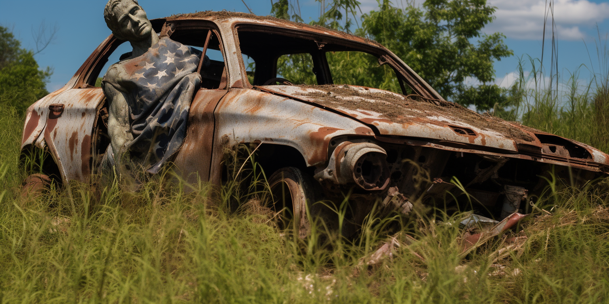
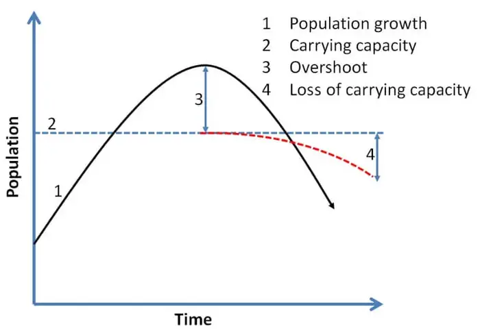

# 10 Reasons Our Civilization Will Soon Collapse (Alan Urban)

That’s right. Our entire global industrial civilization is going to collapse. And soon, which means within the lifetimes of most people alive today.

I realize this is quite the claim, and a pretty terrifying one if you’re under 50 or so. In this article, I will list 10 problems the world is facing, each of which could cause the collapse of civilization all on its own. Which means, if even one of these problems isn’t solved, our civilization is doomed.

Before I continue, let me explain what I mean by “collapse.” First of all, it doesn’t necessarily mean that humans will go extinct. While that is certainly a plausible scenario given the many existential threats we are facing, I still believe it is unlikely. Small groups of humans survived in very difficult conditions for tens of thousands of years.

By collapse, I mean a breakdown of social institutions like governments and economies, followed by a dramatic decline in the human population. I realize that’s still kind of vague, so here’s a more specific definition I found in the book, How Everything Can Collapse.

It says, “A collapse is the process at the end of which basic needs (water, food, housing, clothing, energy, etc.) can no longer be provided [at a reasonable cost] to a majority of the population by services under legal supervision.”

As society breaks down, life will get simpler and simpler. By the late 21st century, people will be living the way they did in the early 19th century.

How do I know this? Let’s start with humanity’s biggest problem. No, it’s not climate change. It’s something most people have never even heard of.

## overshoot as root cause

> Overshoot = Humans are using natural resources faster than they can regenerate. We exceeded the Earth's carrying capacity around 1970 and are stealing from future generations.

We could argue that it’s the only problem we’re facing because every other problem on this list is the result of overshoot. 

If you’ve never heard of ecological overshoot, it’s what happens when an organism uses up an ecosystem’s resources faster than they can regenerate. This happens all the time in nature.

For example, let’s say a herd of deer are placed on an island with no predators and plenty of grass. The deer eat as much grass as they want, and the herd grows exponentially.

As their numbers grow, they eat the grass faster and faster until there is almost no grass left. The grass starts to grow back, but it gets eaten right away, and the deer even eat the roots of the grass, stopping it from growing back at all. Now the population of deer has overshot the island’s carrying capacity. There are too many deer and not enough grass, so most of the deer starve to death. The grass finally gets a chance to start growing back, but the carrying capacity of the island has been reduced.

So the question is: How long until humans overshoot the Earth’s carrying capacity?

> We already did. About 50 years ago.

We have officially surpassed the carrying capacity of our planet. As we begin to run out of essential resources and food becomes harder to produce, the economy will collapse, the population will finally go back down, and civilization as we know it will come to an end.

## we will run out of:

- Peak Fossil Fuels - Conventional oil likely peaked in 2018. Shale oil is too expensive. We need cheap oil/gas for things like agriculture, manufacturing, and transportation.
- Resource Depletion - Essential resources like sand, rubber, fertilizer, aquifers, topsoil, forests, and minerals are being rapidly depleted. Modern civilization is unsustainable.
- Water Scarcity - Drought, aquifer depletion, and climate change leading to critical shortages for people and agriculture.
- Food Insecurity - Soil erosion, droughts, floods, and fertilizer shortages reducing crop yields. Lower harvests will lead to famine. 

## the following makes it worse:

- Failure of Green Energy - Renewables still require fossil fuels for mining materials, manufacturing, transportation, etc. Not enough rare metals to replace current energy use.
- Climate Change - Warming happening faster than models predicted. Extreme weather already straining society. Much worse effects expected in coming decades.
- Biodiversity Loss - Up to a million species at risk of extinction from habitat loss, exploitation, pollution and climate change. Will collapse ecosystems.
- Migration Crisis - Climate change disasters will displace up to 1.5 billion people by 2050, overwhelming nations. Will lead to conflicts.
- Increasing Conflict - Dwindling resources are already causing proxy wars, e.g. Russia/Ukraine conflict. Will worsen as conditions deteriorate.
- Nuclear War - As disasters weaken nations and resources dwindle, risk of nuclear conflict rises, especially among countries like India/Pakistan.

## conclusion

The conclusion is that these threats are serious and interconnected enough that collapse of industrial civilization before 2100 is likely. Immediate action is required to build more resilient systems.

## The original article is on

see https://climateactionaustralia.wordpress.com/2023/10/19/10-reasons-our-civilization-will-soon-collapse/

