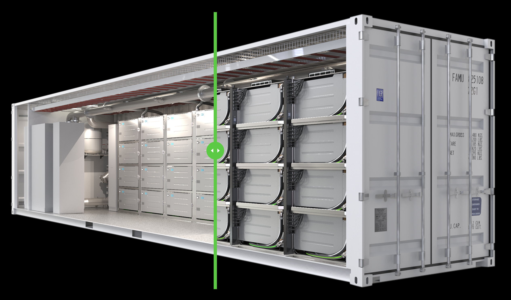

# Tier-S Container System

Complete 40ft mobile immersion system combined with 2 x 2 MW Immersion Optimized Dry coolers and complete primary and secondary hydraulic systems with integrated switchgear system.

> 64 Pod's fit in 1 container

These are very powerful configurations ideal to build cost effective and hugely scalable datacenters.

The containers can be outside but often it makes sense to put then in warehouse style buildings, this provides better protection against the weather elements like sun, wind and rain. It also offers better physical protection.

