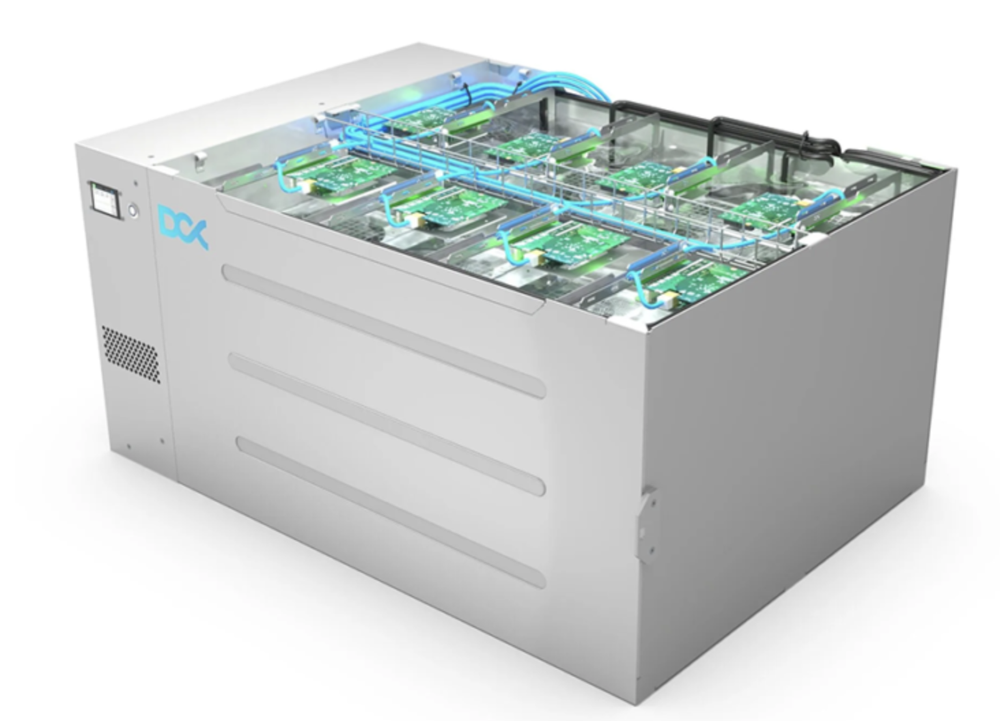
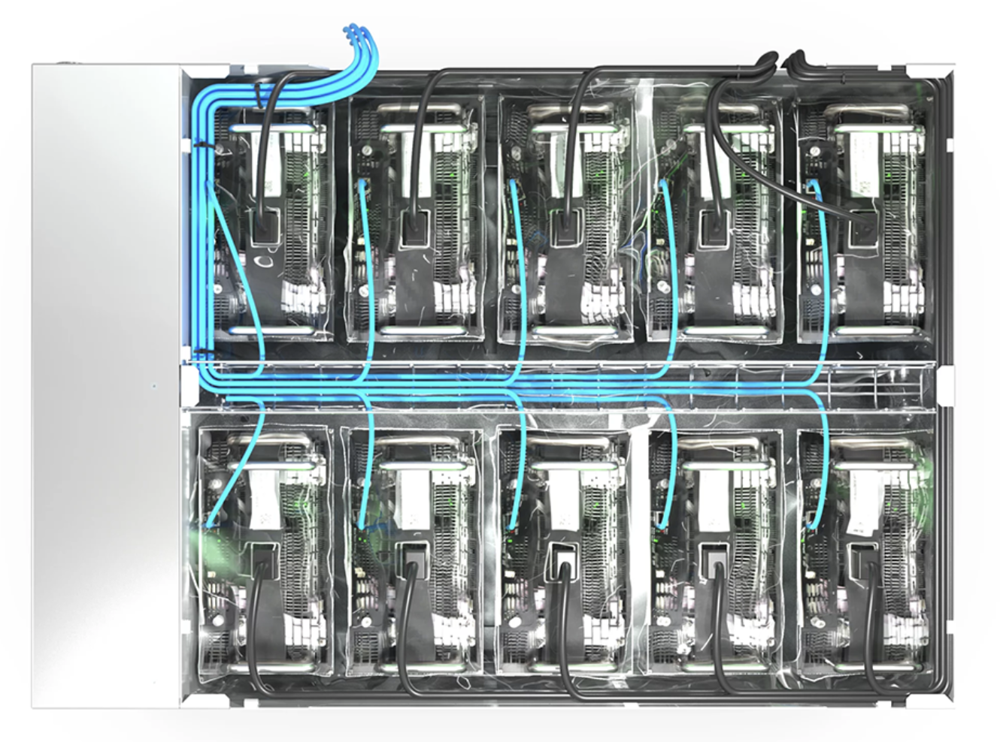
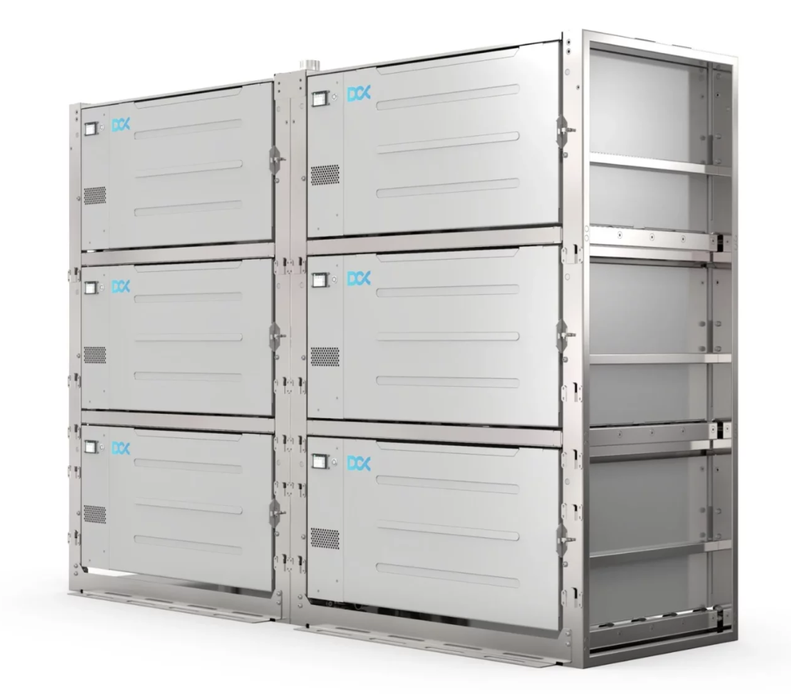
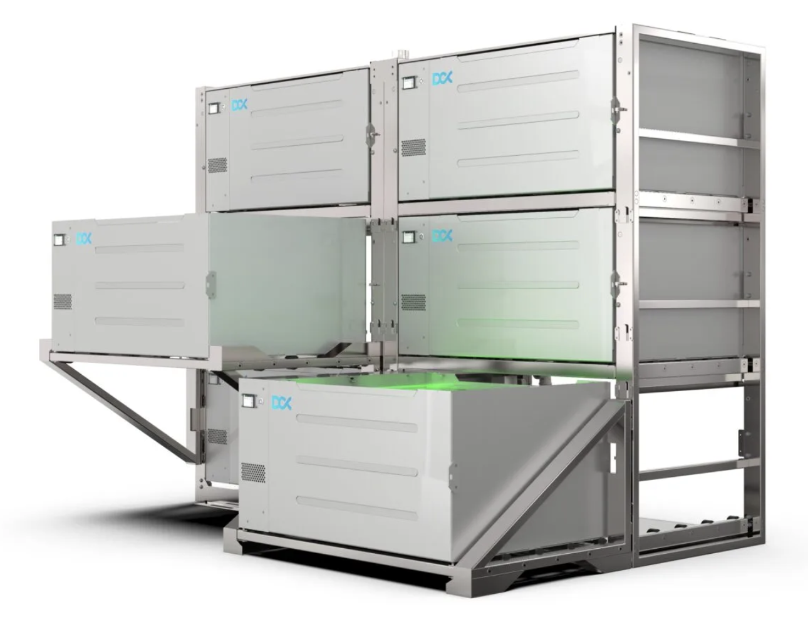
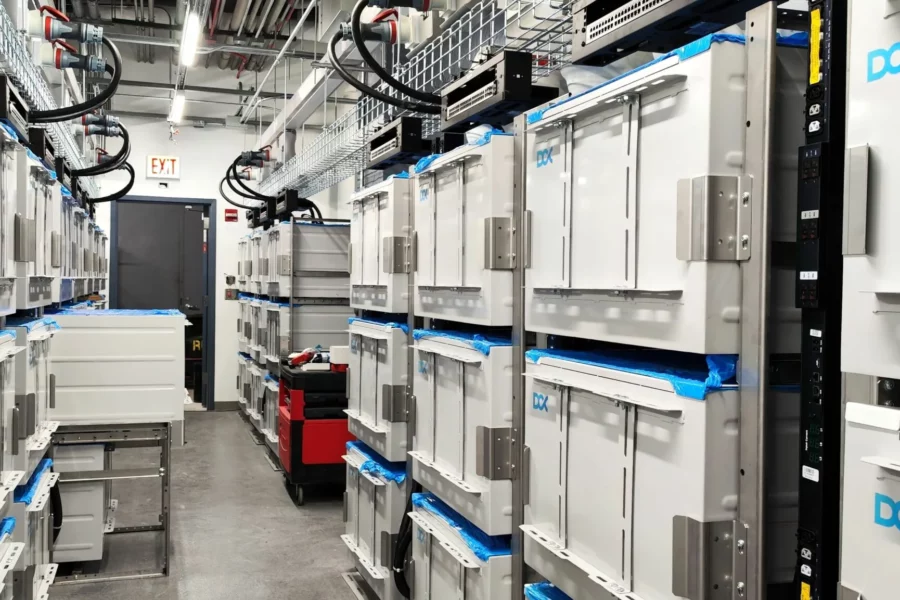

## single pod

Networking nicely integrated:

Maximum cooling capacity: 

The most effective immersion cooling tank in the world. Merging state-of-the art engineering, integrated sensors with TFT screen, remote temperature monitoring & reporting service, with up to 64 kW heat transfer from single enclosure. DCX Enclosure has been designed for heat reuse applications – elevated temperature set point enables sustainable and effective heat utilization. 

- Heat Transfer 35°C	40 kW
- Heat Transfer 25°C	45 kW

## 6 pod

The pod's are easy to maintain.

## integration in std datacenter

## capacity

Below is an example of what can be integrated in 1 pod

- 10 x 24 GB GPU system (AI workloads)
- 20 x CPU 16-24 cores each
- 40 TB high performance SSD (flash)
- 128 TB Storage Capacity
- 2560 GB memory

