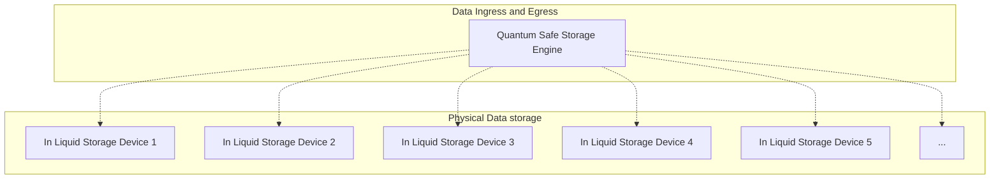

# Quantum Safe Storage

A distributed storage system is deployed on top of the Tier-S POD's over multiple datacenters providing the best possible security and redundancy.

Any storage workload can be deployed on top of the Quantum Safe Storage System.

ZDB are the low level databases which live inside the 3Nodes, a 3Node is like a computer which is installed inside a pod.

The low level storage devices are submerged in the liquid cooling pods. None of the pod's has enough information to make it possibel to restore the data.

The pod's can be over multiple location and as such the most reliable and secure storage system can be created.