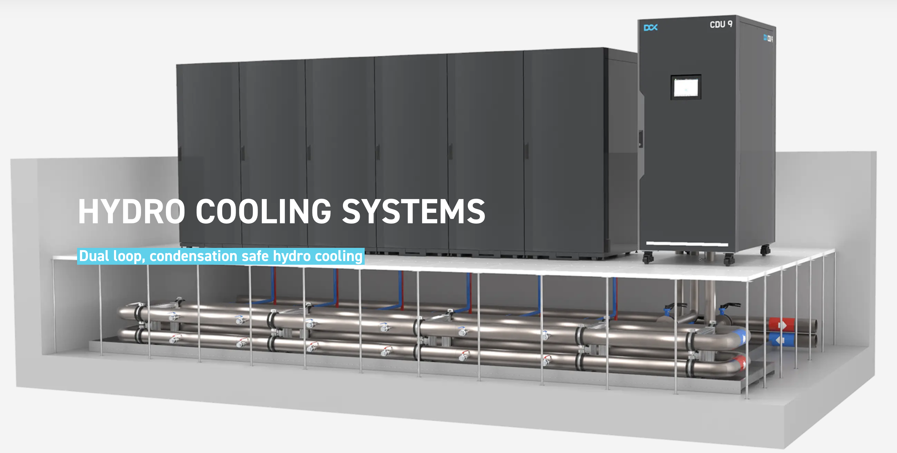

# Tier S Racks

Its possible to integrate liquid cooling in a rack approach, its a more expensive model compared to the [Tier S Pod Approach](tier-s-pod.md).

The cooling system is fully redundant and capable to deliver upto Tier 4 Datacenter specifications level.

