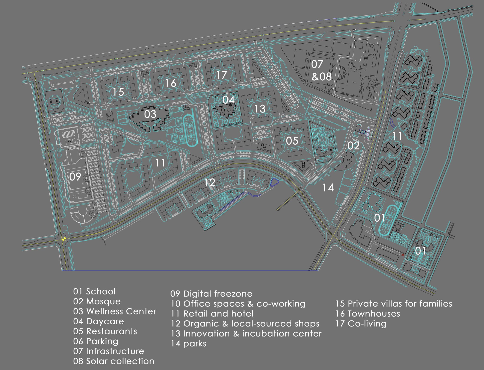
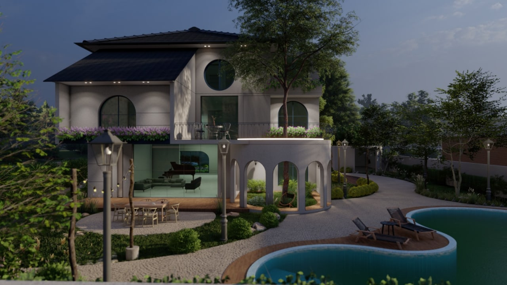

# First Layout

  

The plan above was developed with limited information on the exact size and shape of the land. It shows different residential and commercial options within the project as well as the services offered within the city. 

Our team has started making initial designs for the city that can be used once the size and shape of the land are confirmed. Planning of the movement within the city and infrastructure of the development is also underway. We are in contact with multiple possible partners for partnerships on this aspect of the project as well. 

## Initial designs of OurTown 

The shown rendered images depict some of the initial models our team have developing. The development is expected to be display more greenery and nature. The designs are expected to develop as the project progresses. 

