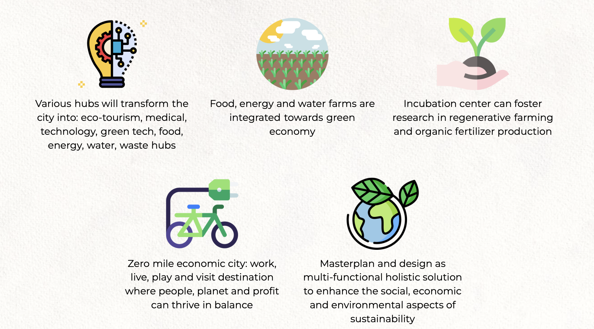

## Space Utilization

  

The city will contain everything that its citizens need. Majority of the land is allocated to nature and recreation areas. The citizens of the city will have a complete eco-living experience with designated parks, bioretenetion areas, work&play environments, and themed gardens. The nature parks will showcase plants that are native to Zanzibar. These environments will be supported by technologies that aim to minimize waste to provide authentic eco-living. Residential areas will be dispersed among the nature and recreation areas to blend the buildings into the greenery. There will be various residential options for the large audience of the project ranging from digital nomads to families of the employess working within the city. 

The digital freezone will attract many digital businesses to the city and its commercial amenities. The city will have a business center with office spaces and co-working environments to meet this demand. The large number of people within the city, whether they are residents, employees or visitors, will be able to shop from many organic and local sourced shops. Moreover, all services needed by the citizens of the city will be provided locally. 

The city will feature the following charactersitics:

 
 
