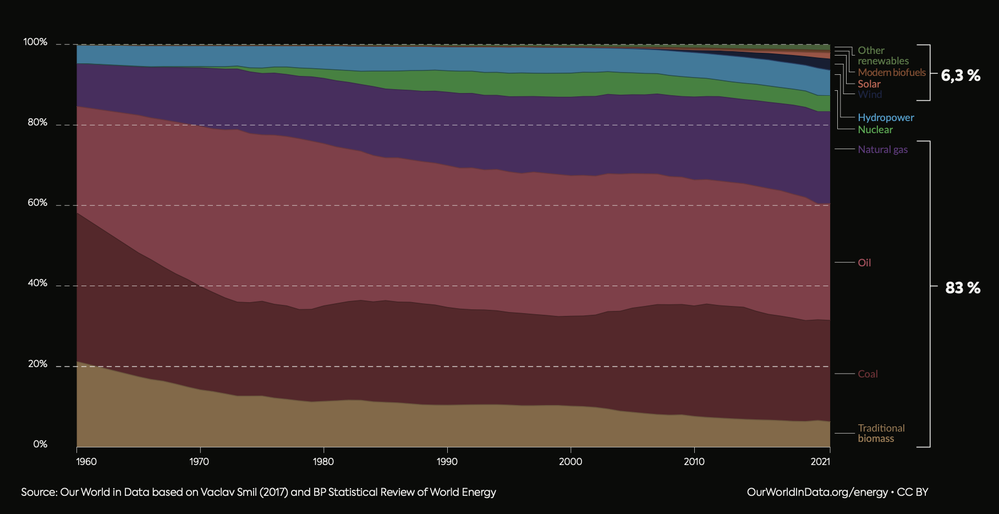
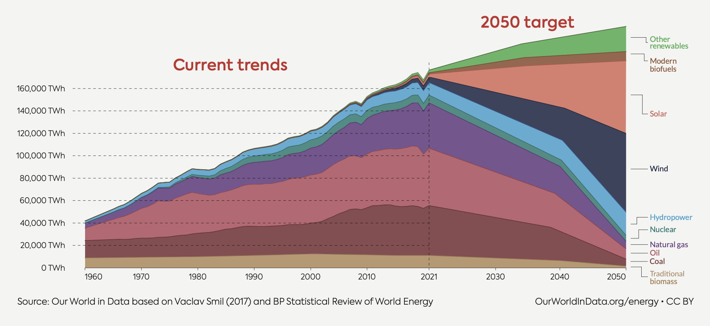

# energy mix

The world's reliance on fossil fuels remains a significant challenge, given its unsustainable nature and prevailing dominance in our global energy consumption. This ongoing dependence is compounded by economic uncertainties and geopolitical instabilities. 

Presently, renewable energy solutions, despite their growth, still face issues with consistent and stable supply, and are not yet universally accessible on demand. 

In essence, moving away from fossil fuels is not just a matter of environmental responsibility, but a critical necessity for our continued existence. 

To better understand this dynamic, it's useful to examine global primary energy consumption by its sources. This involves assessing the production capabilities of various fuels, including how non-fossil energy sources could be transformed to match the energy output of fossil fuels, accounting for similar conversion inefficiencies.

## planned energy mix

The transition in energy supply from fossil fuels to more sustainable sources is a gradual but essential process. While solar and wind energy are anticipated to fulfill a substantial portion of future energy demands, their inherent limitations, such as intermittency and dependency on weather conditions, render them insufficient to fully meet these demands. 

Consequently, there is a pressing need for reliable baseload green electricity generation that can consistently provide power irrespective of external conditions.

