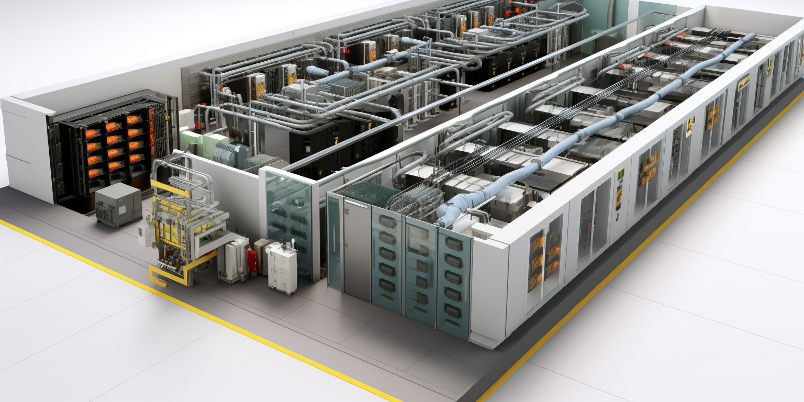

# Tiers

- [Tier 3](tier3.md)
- [Tier 4](tier4.md)
- [Tier S](../tier-s-features/tier-s-circular.md)

## Tier 3 and 4 following Uptime Institute

The Uptime Institute is an organization that establishes standards and provides certifications for data center reliability and overall design. 

- They developed the tier classification system that defines levels of redundancy and uptime for data centers, ranging from Tier 1 (basic) to Tier 4 (fault tolerant). This provides an industry standard for comparing data center resiliency.
- Their Tier Standards and Topology define specific availability and redundancy requirements for different data center subsystems at each tier level. This provides design guidance for engineers and architects aiming to build reliable facilities.

## Tier S following ThreeFold

- ThreeFold has developed an autonomous self healing datacenter concept.