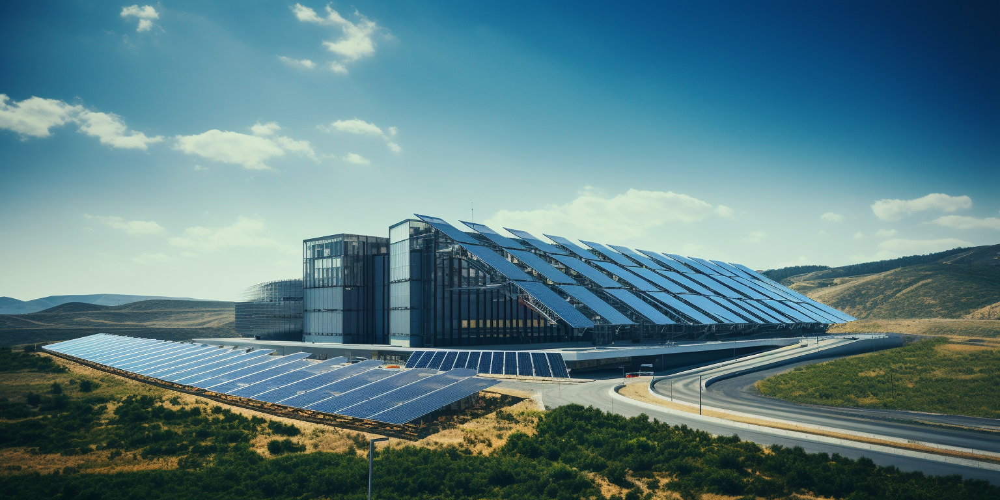

# Introduction: Rethinking Datacenter Design in the AI Era

In an era where artificial intelligence is reshaping our technological landscape, it’s imperative to reconsider how we design and operate datacenters. 

Over the last 30 years, datacenter construction has largely remained static, following a traditional model that is increasingly proving inadequate in the face of modern demands. 

This approach has seen power requirements rise modestly from 5 kW to around 15 kW per rack – a figure that barely scratches the surface of what is needed today.

Contemporary datacenters, with their focus on real estate, risk becoming obsolete if they continue to neglect evolving needs. 

As we stand at this technological crossroads, the urgency to adapt is clear: unless we pay close attention, new datacenters risk repeating the inefficiencies of their predecessors, leading to a poor utilization of investments and a significant mismatch with current and future requirements.

## The 2 Main Design Flaws of Current Datacenters

### Inadequate Power Provision

The advent of AI has dramatically escalated power needs. An AI-centric rack can consume up to 200 kW – a staggering 15 times more than the capacity of datacenters built in the conventional mold. This exponential increase poses significant challenges, particularly when dissipation exceeds 50 kW per rack. Traditional designs fall short in crucial aspects like cooling and power distribution, with conventional air cooling methods becoming increasingly unviable.

### The Shift in Market Needs: Beyond Co-location

The market dynamics have evolved; selling space in a datacenter, akin to ‘advanced real estate’, is a model that’s rapidly losing relevance. The traditional co-location framework, which expects customers to manage their hardware and infrastructure within leased rack space, is becoming antiquated.

In the modern landscape, the role of a datacenter should transcend mere space rental. The emphasis should be on providing integrated solutions – selling compute, storage, and network capacity, not just rackspace and power. It’s about delivering a comprehensive service that aligns with the complex, ever-evolving needs of businesses immersed in the digital and AI revolution.

## Conclusion

In conclusion, the dawn of AI demands a paradigm shift in how we conceive and build datacenters. It's no longer sufficient to adhere to the status quo. The future of datacenters lies in acknowledging and adapting to these emerging challenges – both in power consumption and service delivery. As the world moves forward, so must our approach to datacenter design and operation, transitioning from traditional real estate models to becoming dynamic hubs of technology and service provision.

.