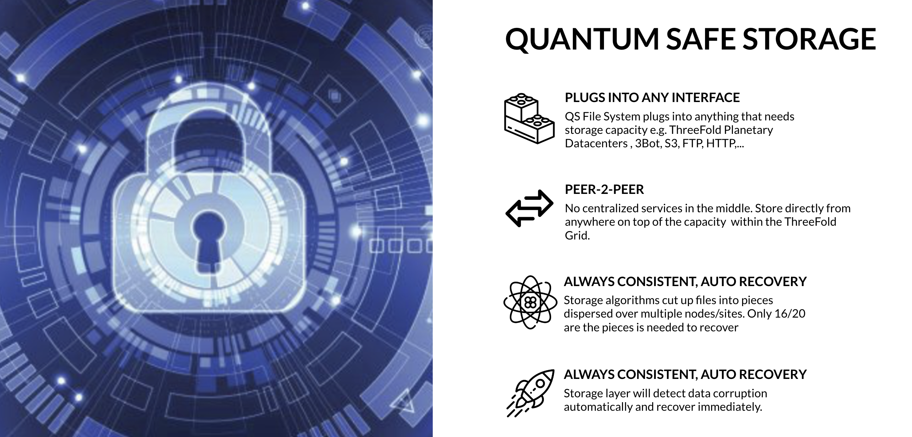

i  

# Quantum Safe Filesystem

A redundant filesystem, can store PB's (millions of gigabytes) of information.

Unique features:

- Unlimited scalable (many petabytes) filesystem
- Quantum Safe:
  - On the TFGrid, no farmer knows what the data is about
  - Even a quantum computer cannot decrypt
- Data can't be lost
  - Protection for datarot, data will autorepair
- Data is kept for ever (data does not get deleted)
- Data is dispersed over multiple sites
- Sites can go down, data not lost
- Up to 10x more efficient than storing on classic storage cloud systems
- Can be mounted as filesystem on any OS or any deployment system (OSX, Linux, Windows, Docker, Kubernetes, TFGrid, ...)
- Compatible with ± all data workloads (not high performance data driven workloads like a database)
- Self-healing: when a node or disk is lost, the storage system can get back to the original redundancy level
- Helps with compliance to regulations like GDPR (as the hosting facility has no view on what is stored, information is encrypted and incomplete)
- Hybrid: can be installed onsite, public, private, ...
- Read-write caching on encoding node (the front end)

## Mount Any Files in your Storage Infrastructure

The QSFS is a mechanism to mount any file system (in any format) on the grid, in a quantum-secure way. 

This storage layer relies on 3 primitives of the ThreeFold technology : 

- [0-db](https://github.com/threefoldtech/0-db) is the storage engine.
It is an always append database, which stores objects in an immutable format. It allows keeping the history out-of-the-box, good performance on disk, low overhead, easy data structure and easy backup (linear copy and immutable files).

- [0-stor-v2](https://github.com/threefoldtech/0-stor_v2) is used to disperse the data into chunks by performing 'forward-looking error-correcting code' (FLECC) on it and send the fragments to safe locations.
It takes files in any format as input, encrypts the file with AES based on a user-defined key, then FLECC-encodes the file and spreads out the result
to multiple 0-DBs. The number of generated chunks is configurable to make it more or less robust against data loss through unavailable fragments. Even if some 0-DBs are unreachable, you can still retrieve the original data, and missing 0-DBs can even be rebuilt to have full consistency. It's an essential element of the operational backup. 

- [0-db-fs](https://github.com/threefoldtech/0-db-fs) is the filesystem driver which uses 0-DB as a primary storage engine. It manages the storage of directories and metadata in a dedicated namespace and file payloads in another dedicated namespace.

Together they form a storage layer that is quantum secure: even the most powerful computer can't hack the system because no single node contains all of the information needed to reconstruct the data.

This concept scales forever, and you can bring any file system on top of it: 
- S3 storage 
- any backup system
- an ftp-server
- IPFS and Hypercore distributed file sharing protocols 
- ...

## Architecture

By using our filesystem inside a Virtual Machine or Kubernetes, the TFGrid user can deploy any storage application on top e.g. AI, Minio for S3 storage, OwnCloud as online fileserver.

Any storage workload can be deployed on top of the Quantum Safe Storage System.

```mermaid
graph TD
subgraph Data Ingress and Egress
qss[Quantum Safe Storage Engine]
end
subgraph Physical Data storage
st1[In Liquid Storage Device 1]
st2[In Liquid  Storage Device 2]
st3[In Liquid  Storage Device 3]
st4[In Liquid  Storage Device 4]
st5[In Liquid  Storage Device 5]
st6[...]
qss -.-> st1 & st2 & st3 & st4 & st5 & st6
end
```