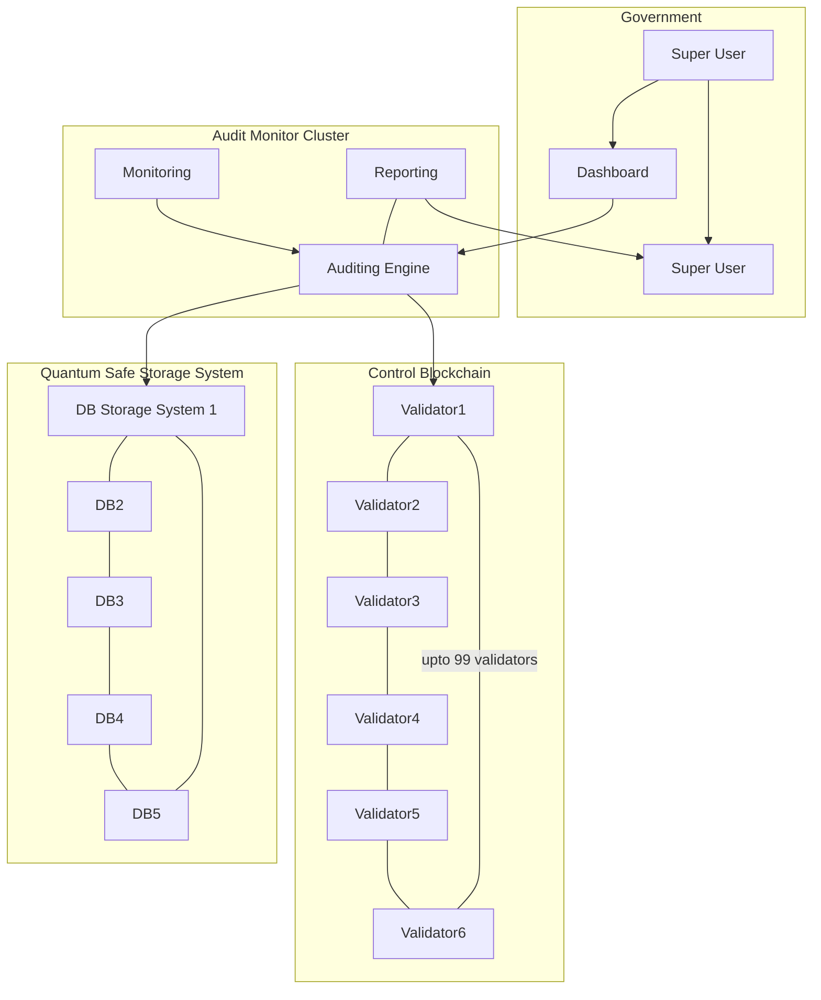

# Tier-S Auditing and Reporting

All provisioning actions as executed on the digital backbone get registered on a quantum safe storage system and the proofs on a blockchain system.

Strongly authenticated users can access a dashboard web interface to consult the Control Backbone Dashboard.

## Information Available

- Detailed monitoring of all operations
- Key Performance Metrics 
- Billing Records
- Resource Utilization Records
- Audit Records
- ... 
