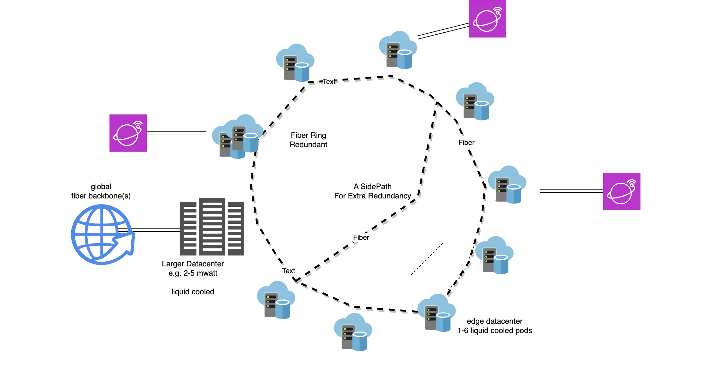

# Tier S Circular

> S stands for Self Healing and can be seen as extensions to Tier 3 and 4 datacenters.

Tier-S datacenters are compatible with Tier 3 and most of Tier 4 but they have additional benefits:

## Principles

- The Tier S Circular approach allows to build the most reliable and redundant datacenters in the world.
- A larger datacenter typically 2-10 mwatt capacity is extended with at least 9 edge datacenters.
- Each edge datacenter is on a ring and can be 3 to 30 pods.
- The main datacenters can be pod, rack based on container based.
- A Tier-S datacenter can be Tier 3 or Tier 4 capable but is constructed in more modern ways.

## More Info

- [Tier-S Container](tier-s-container.md)
- [Tier-S Pod](tier-s-pod.md)
- [Tier-S Storage](tier-s-quantum-safe-storage.md)
- [Tier-S Racks](tier-s-racks.md)
- [Tier-S Audit Flow](tier-s-audit-flow.md)

## Benefits

### reliability

- storage can never be lost
- data can be spread over multiple sites in such a way that not even quantum computers can hack

### redundancy

- all pods are liquid cooled (submerged)
  - liquid cooling is a much more simple and reliable process
- all power paths and network pats are fully redundant

### war and natural disaster proof

- the circular design with main datacenter and edge datacenters makes it much harder to bring a datacenter down in a situation of nautral disaster, war or other unrest.

### self healing

A tier S datacenter, has self healing properties, the aim is that workloads can run in all safety and don't need human super administrators to keep alive.

