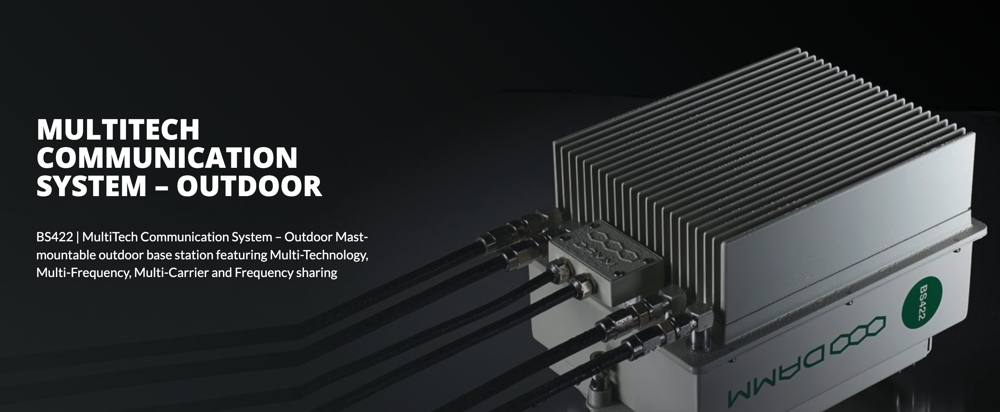

## DRNet Node

  

	
- Multi-Technology
    - TETRA, DMR Tier III, TEDS and Analog in one box
- Multi-Carrier
    - Flexible, cost-efficient solution with up to four carriers in one box
- Multi-Frequency
    - Supports VHF and UHF in all technologies
- Frequency sharing
    - Reduces the frequency need in your network

Outdoor base station featuring multiple technologies in one single core-connected system: TETRA, DMR Tier III, TEDS and Analog. This technology-independent solution features multiple carriers as well as frequency sharing in one box within either UHF or VHF frequency ranges.

### Multiple technologies – one software

With everything covered by one system, operation, maintenance and repairs are simply easy. Multi-technology networks can be managed in a single network management tool with one central subscriber register.  Applications like dispatchers and voice and data log systems can be used across all technologies, and all technologies use the same gateways.

### Frequency sharing

Frequency sharing allows adjacent nodes to use the same frequencies. This is a significant benefit in low-density networks and gives the possibility to cover e.g. a railway line with just two frequency pairs.

### Simplify repeater systems

With frequency sharing you can build an indoor repeater system without optical fibres. The same hardware can be used as base station and repeater unit, increasing redundancy and simplifying the network architecture by having one unified network management system and reduced spare part stock.

## Base station geo-redundancy
You can bring network availability to a new level. Two nodes located at two sites can act as one fully redundant base station, sharing the same frequencies. This will add redundancy not only to the base station, but also to the whole antenna system.

## Reduce infrastructure costs with VHF

Save on infrastructure costs by utilizing VHF frequencies to obtain the same coverage as UHF using fewer base stations.

## Rugged and compact design

Built to withstand harsh conditions – from extreme cold to extreme heat and wet conditions thanks to its IP65 encapsulation. Its compact and light-weight design makes it easy to install everywhere from masts to tunnels and on the back of a truck.

## No single point of failure

At the core is a decentralized architecture, which ensures that all system information is constantly available to all sites in the network. This means that the system does not have any single point of failure. This way, local call and data traffic will run without interruption, even if one site loses its connection to the rest of the network.

## Flexible and future-proof

The flat decentralized IP architecture and intuitive software also enable effortless, self-configuring site expansion. Can be used with single or multiple carriers as well as single or multiple technologies, giving you maximum flexibility.

