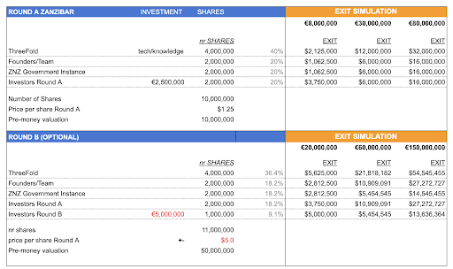
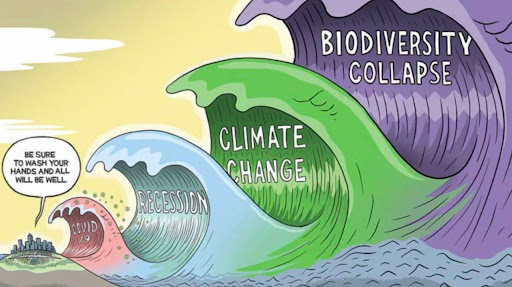

# Approach

We believe a completely different approach is needed around safety and security,ThreeFold wants to create ventures out of the ThreeFold Venture Builder which we call OURSAFETY.IO Ventures and are all focused on specific operational areas. Our first area’s are Zanzibar and Tanzania because we already work very closely together with the government and the request for these services is there right now.

Each Venture is independently funded through a regulated Investment vehicle at start in ADGM the financial center of Abu Dhabi. 90% of the money will only be released once the PPP has been established and the company has been created. 10% is released immediately to finish the feasibility study, create the legal structure and get to conclusion with the government. 

The investment vehicle provides for good upside as well as strong downside protection by means of exit preference. The money in escrow during the startup phase will be kept in multiple currencies and gold.

We will start the process to create the PPP (Public Private Partnership) with TNZ or ZNZ once we have initial 2m USD funded. 

What happens if for an unexpected reason the project would not happen? The investor gets the choice to use 100% of the proceeds for another project from the ThreeFold Venture Builder or can ask money back (the 90%). There are quite some other exciting projects happening.

You can also decide to invest in the ThreeFold Venture Builder itself and as such you would have a stake in each venture created and be at holding level. 

## Quantum Safe Compute System (NEW 2023)

* This is optional and only required when compute safety requirements are ultra secure.
* The compute modules are put in liquid cooling and not connected over TCP/IP (the internet protocol).
* The compute modules communicate over InfiniBand or FPGA custom hardware network switches.
* It's a combination of physical safety (e.g. light sensor, cuts power, …) 
* It's also safe for EMP attack (Electromagnetic Pulse)

# OURSAFETY.IO COMMERCIAL MODEL

OURSAFETY.IO has two models to operate.

## Direct Model

The customer buys the services and products directly from OURSAFETY.IO. This is a very classic commercial approach. OURSAFETY.IO gets a return on a setup fee as well as a maintenance monthly or yearly fee.

It's worth to note that OURSAFETY.IO has a huge cost benefit compared to competitors e.g. our internal cost for quantum safe storage can be as low as 1 USD per TB per month. Market sales prices are 10-200 USD per TB per month. This shows how we can generate the most reliable and secure storage capacity at disruptive pricing.

## Sukuk Investment Model

OURSAFETY.IO gives out Sukuk certificates and finds investors for them.These Sukuk certificates are used to manufacture and acquire the components as discussed above.

The Sukuk holder gets a revenue share approach plus fixed return on the Sukuk Certificates and as such participates in the commercial model. 

The customer does not have to acquire or pre-invest but a revenue share model will be created.

Income is based on:

* Monthly Retainers
    * Monthly retainer for the utilization of the deployed network (all the devices together)
* Utility Based
    * amount of Network/Computer/Storage used
* User Based
    * For OHQ we operate a per user fee, which is between 20 and 100 USD per user per month depending on level of security and services. 
* Benefit Based
    * If Security Cameras give opportunities to charge from irregular behavior e.g. speeding, red light crossing, … a part of the penalty fee will be returned to the Sukuk holders as well as OURSAFETY.IO.

# OURSAFETY.IO INVESTMENT & SHAREHOLDER TABLE

We are organizing a ROUND A investment round of 5m EUR, it's structured as a SAFE. Dubai Vigilance, an investment and asset recovery firm in ADGM, has the license to allow the creation of such a SAFE. Once the SAFE reaches 2m USD a company will be created and the SAFE will convert in shares of the new company. The investors of the SAFE instrument will have insight and voting rights on the construction of the company (location, modalities, …).

We are planning projects in Zanzibar and Tanzania, the investments are spread over the 2 projects, each project will focus on this area. 

## For Zanzibar

* The shares will be tokenized in 2023 or 2024, and liquidity will be looked for
* Investors Round A have 1.5x liquidation preference (means they get their money back 1.5x before anyone)
* Valuation for our Round B unknown

There are already 1500 camera’s on the island and it needs to become much more, the Island is growing quite well. Also the government needs better security for their government operations.

There is a very good downside protection mechanism inside, if for whatever reason the company would not do well and a firesale would not return the wanted result the initial investors first get their money back 1.5 times their investment before any of the founders or other parties get benefit.

## For Tanzania

Tanzania is a big country (5x size france) with 60,000,000 citizens, Tanzania also wants to do commercial business with the countries around. This gives us access to +150m people through the government.

We structure this investment as a PPP (Public Private Partnership).

We are planning 30m USD of revenue within 3 years for this project from which the majority will be recurring, this will lead to a serious valuation.

# OURSAFETY.IO ASSETS

* All required technology (provided by ThreeFold) = result of +6 years of development (50m USD invested)
* Starting Team with all required Knowledge

# PRACTICAL

## Use of Proceeds

* 1.5m USD for operational expansion (team, sales, product management, overhead, …)
* 2.5m USD further integration and engineering.
* 1m USD for logistics and pre-purchase of initial stock (components)

## Revenue

We are very confident to close projects very soon thanks to our relationships with the governments of TNZ and ZNZ. Thanks to their shareholding we are a PPP (Public Private Partnership) and no tenders are needed for new projects.

It goes without saying values are super important to us and we will do everything to make sure TNZ/ZNZ is ultimately protected and becomes one of the examples in the world of how security can be achieved while being cost effective and sustainable for the planet.

## Founder benefits

See the “[venture builder doc](https://docs.google.com/document/d/1SDEiHUY-dDtr8REnUpK-L6trAPoacEuBvJMyTFjVK6Q/edit#)” at the reward pool section.

# 

# RISK MANAGEMENT

## 1.5x liquidation preference

The liquidation preference determines who gets paid first and how much they get paid when a company must be liquidated, such as the sale of the company. Typically, the company's investors or preferred stockholders get their money back first, ahead of other kinds of stockholders or debtholders, in the event that the company must be liquidated.

For instance, assuming the first investors in FreeFlow Labs invest $4,000,000 for 20% of the initial shares of the company at a share value of $2 with a liquidation preference of 1.5x. If the company is then sold for $24,000,000, the Round A investors would generate $6,000,000.

Conversely, if the company sells for $6,000,000, the Round A investors would receive $6,000,000 and the other shareholders would receive nothing. 

## Safe Structure 

Trading across Belgian borders is fast. It takes only one hour to complete the compliance requirements for export. This is one of the reasons why Belgium is ranked number one out of 190 economies in the category of trading across borders by the World Bank’s Doing Business report.

Belgium has a unique tax regime. Numerous corporate tax deductions are available, such as no capital gains, notional interest, and there is a very favorable taxation system for expat employees. Thanks to these measures, the effective corporate tax rate can be significantly lower than the nominal rate and lower than many other countries. In addition, the advanced tax ruling system provides legal certainty for investors.

## We operate in a huge market

The Internet is the second largest and fastest growing industry in the world after financial markets. The size of the Internet’s infrastructure is expected to triple in size this decade. Furthermore, the world is experiencing a digital renaissance — everything is turning digital. 

ThreeFold represents the only decentralized, scalable and efficient Internet infrastructure able to provide for all digital requirements at the edge — A complete blue ocean strategy in a +$10 Trillion industry. 

**The world is changing in front of us, we cannot deny it and we need to act now.** \

We are in the forefront of a growing movement, more and more companies want to prioritize people and planet positive policies. We are not swimming against the stream, we are part of a group of leaders of change and realizing the zeitgeist of the 21st century. 

Companies and investors that fail to be part of this needed movement will seem like dinosaurs by 2030 and be valued by our communities accordingly.