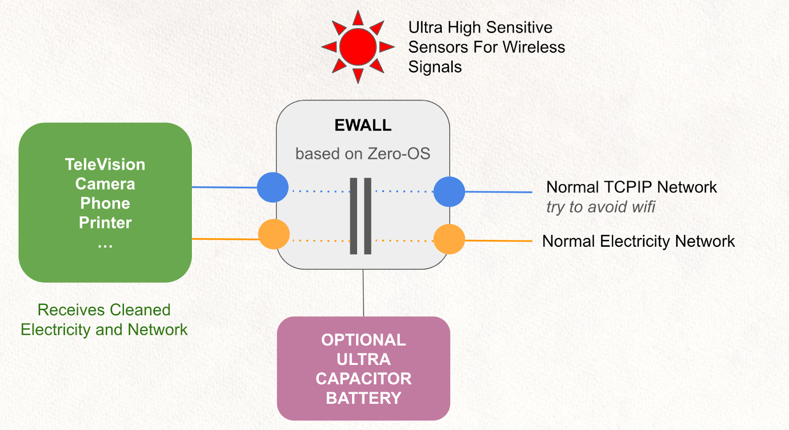
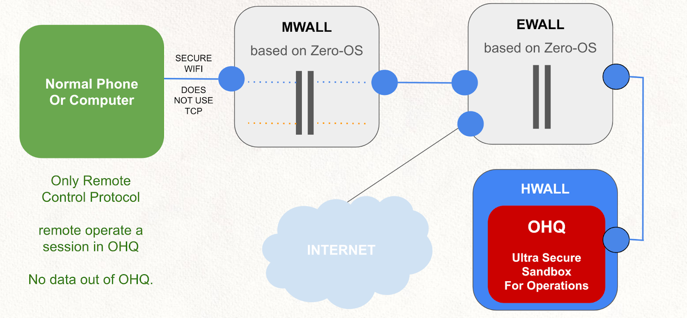

# OURSAFETY.IO

Is a Venture as created by OurWorld venture Builder ([see here ](https://threefold.docsend.com/view/eiuvm5pqtf277982)for more info about our venture builder program).

## Purpose

Allow everyone to experience a safer world without handing over sovereignty to foreign parties. Oursafety is aiming to build a surveillance solution to enhance citizens security based on open, fair and neutral technologies giving the government bodies the ability to understand and learn but also independence and sovereignty from lock-in by vendors.

## The Problem

There are quite some companies delivering security and surveillance technology services. Some potential issues to think about:

- Most Security Systems and/or Security Cameras have backdoors inside (often the vendors are not aware). 
- For cameras, it's too hard and impractical to store and process the large amounts of data as is being produced by the camera’s. The data needs to travel further away before it can be processed.
- Not enough real time actions.
    - See suspicious behavior right away
- Too Expensive
  - Cost of Storage
  - Cost or Processing
  - Cost of Equipment

**Security and Privacy can not be taken lightly**

- Often bugs or backdoors allow hackers to get access to cameras or other IOT devices, this is a breach of private data and in the worst case can be a serious issue for national security.
- How to protect secure and ultra private environments, imagine government buildings or meeting rooms, protection is needed but how to make sure that the surveillance can not be abused by hackers or other remote instances? 
- We are not only talking cameras, but same is true for
    - Televisions and certain projectors.
    - Printers (huge issue)
    - IP Telephones (conference phones)
    - Phone’s (of course people can keep phones out of secure areas
    - Sometimes the security equipment itself e.g. firewalls itself is hacked and has backdoors.

How can you be sure that your vendor is really trustworthy?

- Often the vendors don’t even know themselves and unwillingly allow their customers to be vulnerable.

We are in a real cyber pandemic.

- Even electricity nets can and are used to transmit information and get commands from remote. Over the electricity net it's possible to communicate to devices which aren’t even connected to a wired or wireless network connection.
- Even our mobile phones can now re-transmit and make their own networks e.g. each Iphone has a bluetooth based peer2peer wireless network which is used to find my phone, but it's also a network which can be used by hackers. Bluetooth or other small wireless transmitters e.g. LoRAN are a serious threat to nation security and almost not available. LoRAN can reach very far and allow people to transmit/send commands to your devices to e.g. do surveillance.
- A TV, Printer, Phone, Security Camera are all devices known to be used for remote hacking & surveillance.
- It's almost impossible right now for governments to protect themselves.

# OURSAFETY.IO PRODUCTS

OurSafety has exciting products which are the result of +10 years of engineering and are now ready for commercialization. The first system we plan to release is a camera surveillance system

## OurSafety Surveillance System v1 (Q2/Q3 2023)

Is a super unique camera & surveillance system with following unique benefits

- Backdoors have no chance. Sovereignty guaranteed.
    * All code opensource and delivered to the operating party.
- Absolute best Security & Privacy
    - Code upgrades protected by blockchain.
    -  Commands protected by blockchain.
    - Unique Operation System (close to hardware)
- Billing Integration (optional), to allow multiple parties to make money in ecosystem
- Green and Cost Effective. Can store much more hig h resolution 
- Can scale to country wide level easily
- Unique combination of services in 1 enclosure (see below)
- AI driven processing (face/plate recognition, …) 

Has the following components in 1 surveillance node (enclosure)

- Camera
    - high def, in line to requested quality (has influence on price)
- NetworkWall
    - there is no network connection possible between camera, compute and storage node and outside world), the Network Wall speaks a custom protocol over UDP and end2end heavily encrypted and protected by blockchain identification.
    - Even if there are backdoors left in e.g. camera, they can’t get outside.
- Quantum Safe Decentralized Storage System
    - using forward looking error correcting codes.
    - data is not stored on 1 device, data gets distributed to many nodes at once.
    - data can never be lost nor corrupted.
    - Even a Quantum Computer cannot hack because the storage information at any path is simply not complete to even try to hack or decode. There is not enough info to work with.
- Compute Node
    - optional, if local processing is required
    - Can real time detect suspicious behavior and report back to NOC.
    - Integrates seamlessly with the Network and Storage System
- Quantum Safe Decentralized Network System
    - Network is not following one path, get distributed over multiple paths at once.
    - Even a Quantum Computer cannot hack because the network information at any path is simply not complete to even try to hack or decode. There is not enough info to work with.
    - Ultra reliable, redundant, can use multiple physical paths (satellite, 4G/5G, fiber, wireless, …) all together ! 
* BlockChain
    - There is a custom blockchain inside, this allows very strong verification of commands and ultra resilient operation. Multi-signature commands and upgrade paths are foreseen.

## OurSafety EWall (end 2023)

This device is still in the research phase but we have developed similar devices in previous company's from our Venture Builder (company was called Racktivity).

This device cuts the network and electricity connection because both can relay signals and network information.

The EWall will also have very sensitive sensors to detect unwanted bluetooth, meshed wireless, Lora and other unwanted communication signals. 

If the EWALL detects suspicious behavior it will cut the network and electricity to protect people inside. The EWall will clean electricity to only have clean power with optional battery protection.

This device is an absolute "must have" in high security sensitive places. Most (if not all) current devices are backdoored and it's just a matter of how much it costs to access them.

While the EWall may sound like a boring device but it's ultra important to secure safe environments to operate from. The world became a very unsafe place, the cyber pandemic is real.

## OurSafety MWALL (end 2023)

A custom designed mobile device to protect your digital life when you are on the road.

This mobile device is running Zero-OS and connects to the internet over WIFI or 4G/5G, it terminates all TCP/IP traffic. It runs our quantum safe network and storage system inside, this allows ultra safe data storage and communication to other components of the OurSafety ecosystem.

The person using the phone or computer connects to the ultra secure OHQ for secure Operations.

Phone’s today cannot be protected and it's almost impossible to do so, there are simply to many unsafe hardware and software components in everyday's phones.

Our approach allows you to still use a normal phone (we recommend using a hardened phone though) but getting much more security.

We especially don’t trust iPhones and some of the modern android phones these days because of the hidden network functionality they have over peer2peer bluetooth. We are not claiming that apple cannot be trusted but even if they are ok, this is a huge opportunity for hackers create to create network connections into your phone even when it's powered off and not connected to a wireless of 4G connection, the only thing it needs is other bluetooth devices around which have this meshed bluetooth network functionality inside. It's only time before this techno finds it's way into televisions, printers, and other iOT devices.

## OurSafety OHQ (2023)

OHQ stands for Operations Head Quarter.

The OHQ is installed in a HWALL, a HWALL = HydroWall is a liquid cooling environment for compute, we use infiniband or FPGA based communication between the computers in the HWall.

A HWALL is safe for EMP attacks and will keep dust and humidity out. It will get hardware to live longer and be ultra stable. A HWALL is a system which submerses the compute and storage hardware in a safe liquid.

The OHQ is your secure environment in which you can connect with the rest of the world when needed, but most communication, collaboration stays inside the OHQ protected environment.

In OHQ the following services are available:

- Messaging (chat and ultra secure email in sandboxed environments)
- Ultra Secure Document Collaboration (full MS office compatible)
- Secure Audio/Video Conferencing
- It is a strongly authenticated environment but supports anonymity while still being strongly authenticated.
- Full Secure Escalation & Project Management (ultra secure & private)
- Events Management (see what happens in the world)
- Flexible Dashboard & Monitoring System (give overview on operations)
- Knowledge Base & Secure eEducation system

The system is ultra secure, no documents or communication (messages) go out of the OHQ !!! 

## OURSAFETY.IO TECHNOLOGY SPECIALS

Following components are 100% made available by ThreeFold to the OurSafety Venture and the result of more than 10 years of development. The components are now 3e generation and are used in the field on a global scale in the ThreeFold grid.

## Zero-OS

- ThreeFold has developed a unique operating system called Zero-OS which has no installation footprint and is fully managed and operated through blockchain technology.
- The Operating System has no shell or server interface.
- Zero-OS can be embedded and deeply integrated by available hardware.
- Zero-OS can even be integrated on the camera itself, to make sure it cannot be operated by unwanted teams and multi-signature is available for sensitive operations like upgrades.

## TFChain

- A custom blockchain which operates all Zero-OS’es.
* Has also financial modules inside which allows monetization of the network.
* Smart Contract for IT allows secure operation of a network.

## Quantum Safe Storage System 

* A unique storage system where data can never be lost nor corrupted.
* Data can scale to zetabytes (thousands of petabytes)
* Quantum computers cannot hack it.
* And it's also a very green and cost effective system
* Optional: there is a billing model inside, the parties providing connectivity get paid for the service they offer.

## Network Wall

* This is not a firewall, it's a real Wall, no network traffic goes between the inside and the outside.
* The network wall speaks the outside protocols and will bring the data only without using TCP IP to the inside, this disconnects the inside systems completely.

## Planetary Network

* Is an overlay network, using other existing networks e.g. the current Internet.
* End2End encrypted.
* Look for the shortest path.
* Provides redundancy
* Integrated Billing if required.

## Quantum Safe Network System (NEW 2023)

* A unique concept where data is sent over multiple network paths as once and only when they get recombined at the destination the packets make sense again. Think about it like a letter is cut in 10 pieces, and send over 10 paths, every path can only see 1 of the 10 pieces which would make it hard to make sense out of the total. The algorithm we use is smarter, and makes sure that the data is meaningless and can not be reconstructed if not enough packets arrive.
* The network is able to have a certain amount of lost or corrupted packets, it would still allow reconstruction (redundancy), the technology used is called forward looking error correcting codes and is used in space for error detection.
* It can use multiple network paths 4G/3G/Wireless Peer2Peer/Fiber/Satelite … all at once.
* Optional: there is a billing model inside, the parties providing connectivity get paid for the service they offer.

# OURSAFETY.IO IS A FOR PURPOSE ORGANIZATION

Example see  [https://purpose-economy.org/en/](https://purpose-economy.org/en/)

This means

* Specific share distribution (after 2 rounds)
    * 36% to investors
    * 30% for ThreeFold (the technology partner and provider)
    * 12.5% to benefit of the contributors (by means of a For Purpose Reward Pool)
    * 16.5% to benefit of ZNZ/TNZ Government
* All the cash generated keeps on being re-invested in the company,  \
this has the chance to create exponential value creation by constant re-investment.
* Exit for the investors is by means of 
    * Security Token Offering
    * Private (re)Sale of the shares
    * Buy back of the shares by the For Purpose Organization

# PLANET AND PEOPLE FIRST APPROACH

<table>
  <tr>
   <td>

>>>>>  gd2md-html alert: inline image link here (to images/image8.png). Store image on your image server and adjust path/filename/extension if necessary.  (<a href="#">Back to top</a>)(<a href="#gdcalert9">Next alert</a>) >>>>> 

   </td>
   <td>We believe in following required values:
<ul>

<li>Authenticity = without authenticity there is nothing

<li>Planet = value as created for the planet

<li>People = value as created for communities \

<li>Profit is the result of above

Anything we do needs to improve our planet's situation (climate change, regenerative, respect resources, …) and help the people around us. As a result of doing so, we as investors of our time and money will have created most value and will get the benefits from our efforts. \

</li>
</ul>
   </td>
  </tr>
</table>

Read more about our mission as used for one of our startups see [http://mission.threefold.me/](http://mission.threefold.me/) 
