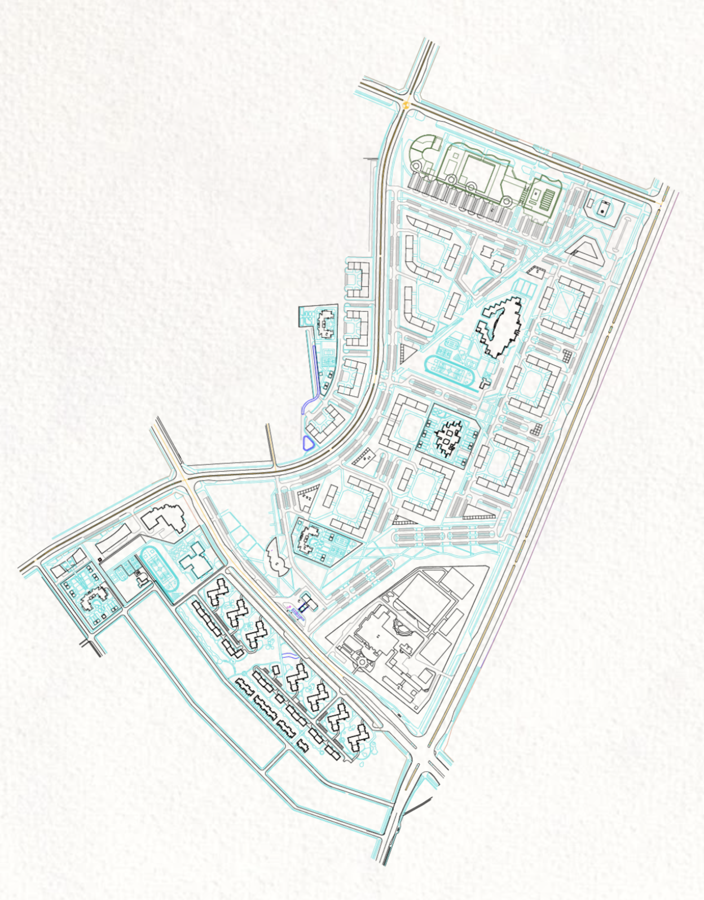

# OurTown Intro

  

The plan above was developed with limited information on the exact size and shape of the land. It shows different residential and commercial options within the project as well as the services offered within the city. 

Our team has started making initial designs for the city that can be used once the size and shape of the land are confirmed. Planning of the movement within the city and infrastructure of the development is also underway. We are in contact with multiple possible partners for partnerships on this aspect of the project as well. 

# Initial designs of OurTown 

The images used here are for illustrative and showcasing purposes only. After discussing in length with the appropriate authorities, final and more specific renders will be presented.

## Sustainable residences

The residences will be placed within greenery and nature. Inner roads of the city will dsiscourage cars to provide clean air and provide reduced noise pollution levels within then residential areas. Amenities such gyms, swimming pools, walking paths and cycling trails are located close to these areas for comfortable living and convenient access to other parts of the city.  

  

 

## Sustainable offices

All of the commercial operators in OurTown will also be encouraged to follow planet-friendly practices. They will be able to use all of the green-technology available in OurTown to make their operations regenerative and sustainable. The concept Renderings below depict the the commercial areas and how they blend in with the residential areas and nature. 

  

 

## Regenerative practices

OurTown has a commitment to be a carbon-neutral development, meaning renewable energy systems will be integrated into the city in many locations. There will be areas designated to energy generation and solar potential from roofs will also be realized. Using thermal insulating construction materials and windows, smart home automation, water-saving appliances, energy-saving electrical fittings and rooftop solar PVC installations, the new residents of Zanzibar’s  Sustainable City are projected to enjoy savings of up to 50% on their electricity and water bills.

  

The food supply of the city will be supported by regenerative farming practives within and and outside the city. Integrated farming zones within the city will provide produce to the residents while serving as an educational tool for the youth. The regenerative farming locations that are close to Fumba will provide additional support to the food suply. 

  

