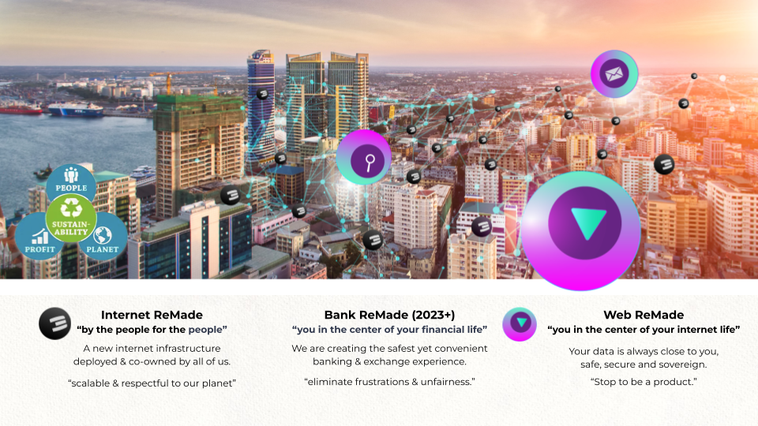
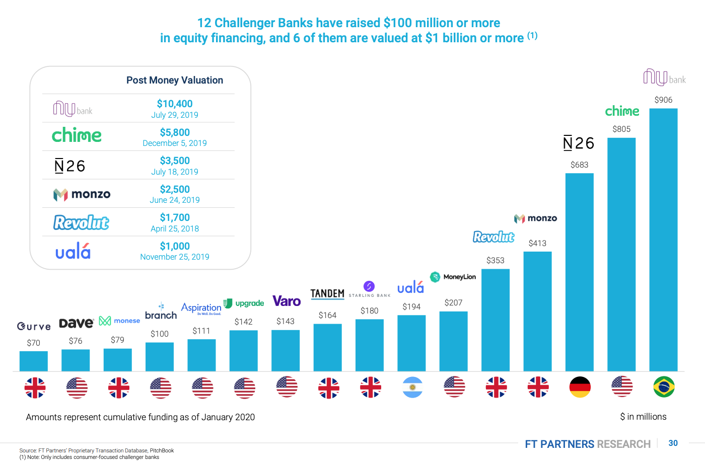
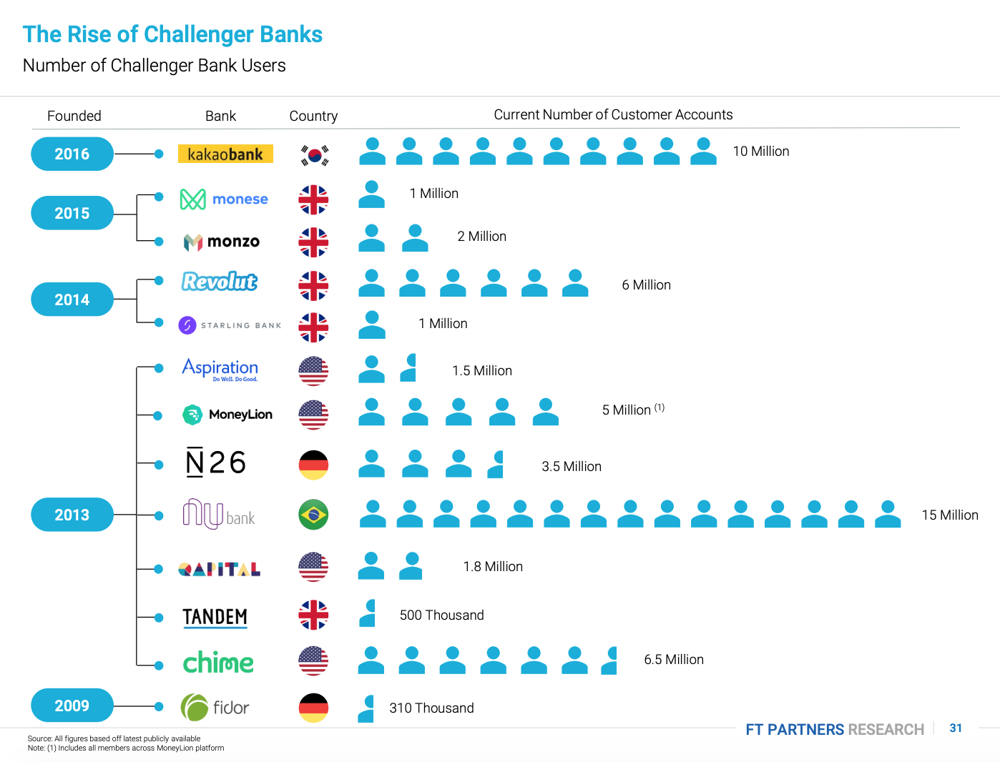
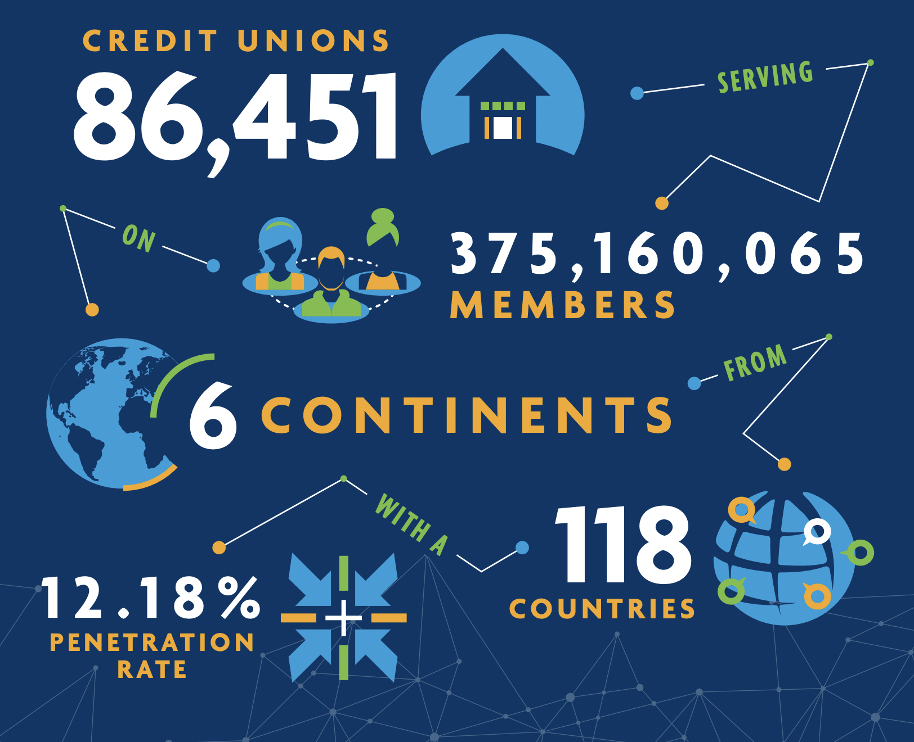
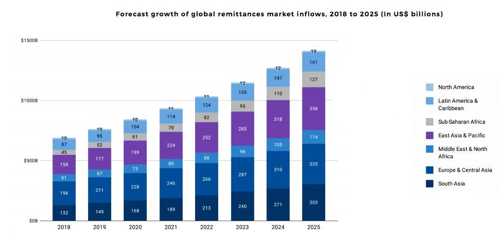
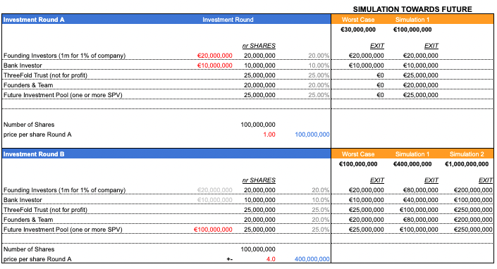

The Internet has the potential to expand human consciousness. If used properly, it can be our joint pool of all available knowledge, an unlimited source of creativity and a limitless collaborative tool where everyone can safely communicate and exchange anything for everything in safe and fair ways. Unfortunately this is not the Internet as we know it today. It is owned by the very few, and the rest of us have become products in an excessively capitalistic system.

We are creating a new system. This all started with a group of crazy people and "nerdy" engineers who decided to stop talking and just build a new system. We didn’t ask for permission. We didn’t do a crypto ICO full of empty promises. We started building!

With the help of more than 80 investors and thousands of project supporters we have been able to build a lot and 
are working on even more:

* A new internet infrastructure platform (fully peer2peer and decentralized, and super reliable) = ThreeFold

* A new decentralized and regulated finance & digital asset exchange system, based on values (work in progress)

* A set of incredible experiences, with the ability to provide digital freedom for all our online requirements.

* An upgraded economic system platform where no money needs to be paid to offer or find information, 
where lock-in does not exist.

* A Digital Twin system which is the base of Banking and Web 4.0; a new way to communicate, share, collaborate.

More than 50m USD has been invested in Threefold so far, we have a very active community of hundreds of contributors and we are working with governments to deploy the system in their country.

We are excited about a future where together we can create a safer platform, based on values, transparency and love. We are excited not because of hopes and discussions, but because we have a practical, concrete plan and a can-do mentality. Not in a talking way, but in a super practical way with a can-do mentality and a concrete plan.

**This document presents to you the opportunity to be part of the first web and banking 4.0 system in the world.**

We are doing it, join us… become part of our movement.

**The world is changing in front of us, we cannot deny it and we need to act now.**

We are in the forefront of a growing movement. More and more companies want to prioritize people and planet positive policies. We are not swimming against the stream; we are part of a group of leaders of change who are manifesting the zeitgeist of the 21st century. 

Companies and investors that fail to be part of this needed movement will seem like dinosaurs by 2030 and they will be valued by our communities accordingly.

# REGENERATIVE PLANET AND PEOPLE FIRST APPROACH

<table>
  <tr>
    <td></td>
    <td>We believe in:

Planet First
People Second
Profit As Result

Anything we do needs to improve our planet's situation (climate change, regenerative, respect resources, …) and help the people around us. As a result, we, as investors of time and money, will have created more value and will reap the benefits from our efforts.

</td>
  </tr>
</table>

Read more about our mission in [http://mission.threefold.me/](http://mission.threefold.me/) 

# 

# OurWorld Web 4.0 and Banking 4.0 Mauritius

Imagine a super secure place in the world with more than a million citizens in a safe and democratic country and environment, with reach to more than a billion people through their financial and internet connections. Mauritius is that place.

On this beautiful island we have the chance to rewrite history and enact the first deployment of web 4.0 and banking 4.0 for many millions of people in the world.

## OurWorld E-Bank 

OurWorld E-Bank (the "Bank") will be based on a fully secured blockchain technology and Web 4.0 (Peer-to-Peer)  technology which will be lower in cost, more scalable, much safer and not as vulnerable to be abused by its users due to ThreeFold Open-Source Technology. 

### Our Belief 

We believe in the next generation of Banking 4.0 solution that can bring the following benefits: 

* Decentralization: Ultra Secure, Reliable and Auditable for required use cases

* Cost Effective 

* Cater for more unique and complex use cases compared the current solutions. 

* Allow ongoing innovation and creation of the most powerful, safest fintech solution. 

* 100% GDPR Compliant 

* Due to our technological infrastructure and business model, we are completely aligned with the UN Sustainable Development Goals. 

### Our Aim 

Our aim is to protect and to provide massive added value to the following actors: 

* **Banks, Financial Institutions, and other Fintech Organisations**

    * Deploy and operate a future proof digital bank and gain required speed to market/scale globally. 

    * Competitive Advantage.

    * Provide promising business models for revenue creation and insightful opportunities to cut unnecessary costs.

    * Ultra scalable at an unmatched cost basis.

* **Banking Users - Individuals **

    * Enable 100% GDPR compliance.

    * Prioritize data privacy with our back-end technology, protecting users from hackers and any potential abuse. 

    * Facilitate rapid and simple use of the system with many possibilities. 

* **The Planet **

    * Carbon Negative 

    * Ultra Scalable while using less hardwares and energy resources. 

# Market Analysis 

The E-Bank (Neo/Challenger Bank) market size was valued at USD 28.73 Billion in 2020 and is projected to reach USD 627.99 Billion by 2028, growing at a CAGR of 47.17% from 2021 to 2028.

## Current Competitor’s Valuation 

Please note that even with their high valuation, none of these banks use a fully secured and peer-to-peer technology, implying that OurWorld E-Bank has tremendous potential in this banking market. 

## Customers Analysis 

## 

## Credit Union Analysis 

* There are 375 million credit union members in 118 countries around the world. In Africa alone, there are 40,000 credit unions (46% of global total).

* Credit unions are also present less formally, for example as religious communities in which the church acts as a credit union. Local churches are part of wider church associations up to even the national level, which will make deployment far simpler

* The predominance of low-value transactions provide a high barrier of entry to conventional banks which have high processing costs per transaction. OurWorld is able to avoid this barrier through efficient Threefold technology.

## Remittance Market Analysis 

The [remittance market](https://www.un.org/development/desa/en/news/population/remittances-matter.html) is ever expanding with inflows to Sub-Saharan Africa being predicted to grow by at least 20%, with an average CAGR of 16%. Around the world, there are over 200 million people sending remittances. 

# Unique Value Propositions 

Threefold Peer2Peer technology

* By operating on the Threefold decentralised grid ("ThreeFold Grid"), users transfer money directly without passing through the hands of intermediaries or centralised data centres. This enables lower fees and safer transactions for users all the while being less vulnerable to hackers and untrustworthy third parties

* On an international level, total commissions are around 10% in existing systems. Threefold offers a unified international transfer system, whereby we reduce costs by bringing all parts of the transfer chain onto one platform. This has the auxiliary benefit of massively simplifying applicable legislation.

Native integration with Digital Twin

* OurWorld E-Bank offers an extensive range of banking solutions all made available through the use of Threefold’s Digital Twin. The Digital Twin provides users with all their internet needs - communication, file storage, banking and many more - all while ensuring that users have sovereignty over their data.

**Cost Effectiveness:** Unique access to rural African market

* Currently, 350 million adults in sub-Saharan Africa are unbanked. Conventional banks are unwilling to offer their services because there are substantial initial and recurring costs; IT set-up and maintenance, rent, wages and cash management. OurWorld is able to minimise these costs through various local partnerships, which will offer money-depositing services. Moreover, due to the nature of the transactions (high-volume, low-value transactions), the KYC regulation would be relatively light.

# Solution Roadmap

## Phase 1: Minimum Viable Product ("MVP") 

During phase 1, the Bank will have the following core banking features: 

* Multiple Accounts (Current, Savings, Fix Deposit) - Stored on the Banking core blockchain 

* Account linked with debit cards

* Visa, Mastercard or Union Pay branded Credit Cards 

* Fund transfer and Remittance

* Exchange between currencies and chosen set of reliable digital currencies

* Personal Finance Manager - Client Relationship 

* KYC/AML verification process - Stored on the Banking core blockchain 

* Basic internal and external (regulatory) reporting on transactions 

* Back office functionalities such as organization set-up, process flow, dashboard, other various teller functions/management functions, reporting engine

* Ecosystem integration (revenue-producing business processes with ecosystem partners)

Please note that a Browser Firewall will be used to protect all access from customers to their Digital Twins (the "Twin") - Key component of the Web 4.0. Each Twin has all the knowledge required to be an independent actor in the banking system. Each customer can either freeze or delete their Twin at any point in time, and close their account following a “predetermined” process. 

Additionally, all data is stored on blockchain and/or on ThreeFold’s Quantum Safe Storage System. The banking system will be 99% "Self-Healing" and Autonomous which will therefore rarely require any human intervention - leading to incredible security and high up-time. 

## Phase 2: New Horizon 

For the second phase, the Bank will have the following possible integration with: 

* Banking Enable Metaverse Technology 

* Augmented Reality 

* AI driven algorithms helping customers in the secure metaverse to get support

* Virtual Reality Banking Experience (For instance; Help Desk, etc.)

* Integration with E-Commerce solution directly onto their banking account

## Phase 3: New Possibilities 

Phase 3 will focus on additional banking features such as: 

* Digital Currency Integration 

* Insurance products 

* Investment products 

# Revenue Stream

With the purpose of fully automating the banking process as much as possible, a monthly cost between 1-5 Euros will be charged to each user, depending on the size of the deployment and requested features. Additionally various premium plans will be offered to them. 

# Funding Requirements 

OurWorld E-Bank is looking to raise **25 million Euros** as part of its first funding round - Please see the [Funding Roadmap](#heading=h.9qdgzos7eecw) section below for more details about the use of funds. 

## Investment Terms 

Below are the important terms for the investment: 

* Total Investment Size: 25 million Euros (€25,000,000) for 25% of equity in the Bank 

* Co-Founding Investors: 

    * Investment per Ticket: 2 million Euros (€2,000,000) for 2% of equity in the Bank 

        * Number of tickets: 10 

* Bank Investor (Required by Regulation) 

    * Investment: 5 million Euros (€5,000,000) for 5% of equity in the Bank 

## Investor’s Downside Protection 

* One-time liquidation preference, i,e investors will be paid before anyone else during exit process 

* The investment proceed is only invested once milestones are achieved 

* For the next funding round, investors’ participation from the first funding round, **won’t** be diluted. For the next funding round, shares from a SPV (Special Purpose Vehicle) will be sold -** See Cap Table Below**. 

## Cap Table

# Funding Roadmap

## Funding Round 1: 25 Million Euros  

### Phase 1: 8 Million Euros - Application & Planning

#### Licenses and Company Set-Up - 2 Million Euros 

This phase will be focused on setting up the legal structure of the company and aligning all the requirements in order to apply for the banking license in Mauritius - This will be done by a high-qualified and experienced delegated team. 

*Please note that we have the full support from the Mauritius Government (The meeting has been successfully and we will receive full support from them). *

#### Working Capital and Technology Implementation - 6 Million Euros 

In order to scale the solution, OurWorld E-Bank will use ThreeFold Open-Source Peer-to-Peer Technology. Part of the fund will be used to support the technology implementation in the country. Additionally, it will also fund operations and meet short-term obligations. 

### Phase 2: 17 Million Euros - Mobilization + Transition 

#### Banking Capital - 10 million Euros 

Capital is a key ingredient for safe and sound banks. In order to mitigate any potential risks and protect the people’s deposit, part of the funding will be dedicated to the bank capital. This will be used to absorb any foreseen losses and keep going in good times and bad. 

#### Working Capital and Team Expansion - 7 Million Euros 

The phase 2 will be again support the working capital of the financial organization and increase the size of the team in order to cater for the future demand. 

*Please note that by the end of this phase, we expect to have at least 1,000 banking users operational with our Minimum Viable product (MVP) - Testing phase. A sales team will be fully dedicated to sign service contracts with companies/group in order to bring additional users in the near future. *

## Funding Round 2: 75 Million Euros  

The Funding Round 2 will happen just after receiving the banking license,  the implementation of all the legal requirements for the company, the deployment of the technology and the testing. 

The use of the fund will be used to further expand our solution & the team, guaranteeing the financial well-being of the bank and offering the service to a wider group of individuals and companies. Please note that upon this phase, we expect at least 100,000 users using our banking solution. 

# Risk Analysis 

This section is to inform any potential inventors about the potential risk that OurWorld E-Bank will be facing and how the organization will mitigate these risks. 

### Liquidity Risk 

One of the risks of the bank is having insufficient liquid assets to compensate for the cash needs/withdrawals from depositors or any potential loan demand. Following our first funding round, part of the funds will be dedicated to consolidating the initial capital of the bank in order to cater for any potential demand from the first clients - in addition to the revenue stream of the bank, this will guarantee the solvency of the organization. 

In a situation where the OurWorld E-Bank might be facing liquidity problems, with the support of the Government, immediate funding needs can be covered by the country’s central banks or other sources (coming from ThreeFold Group). 

### Legal Risk 

One important risk to be considered is approval for the Banking License by the country’s authorities. Please note that a high-level team with experience in the banking sector will be dedicated to implement the legal structure and apply for the banking license. Additionally, as mentioned above, we have full support from the Mauritius Government. 

### Market Risk

Market Risk/Systematic Risk (Idiosyncratic Risk) is related to any potential downturn coming from the market and the organization will be engaged in market activities. OurWorld Bank will counter or mitigate this risk by engaging in diversification and hedging strategies (done through Portfolio Management). The bank will have a diversified treasury with different assets and commodities such as Gold. 

### Technology Risk

Technology risk arises from the use of computer systems in the day-to-day conduct of the bank’s operations, reconciliation of books of accounts, and storage and retrieval of information and reports. Built on top of ThreeFold Technology, the infrastructure has been proven to provide to the OurWorld E-Bank’s ecosystem a fully secured solution based on blockchain technology. Thus, using ThreeFold Open-Source Technology will mitigate the potential risks that traditional banks are facing. 

