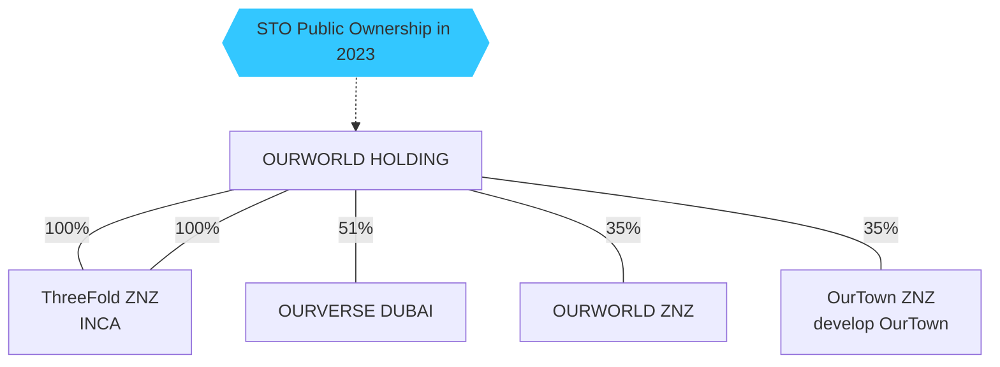
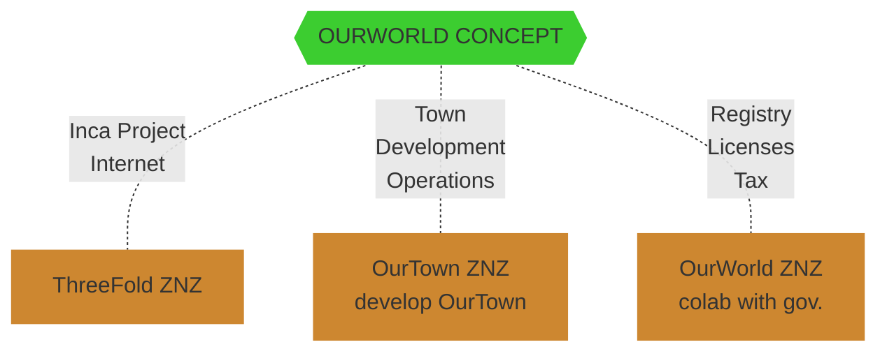
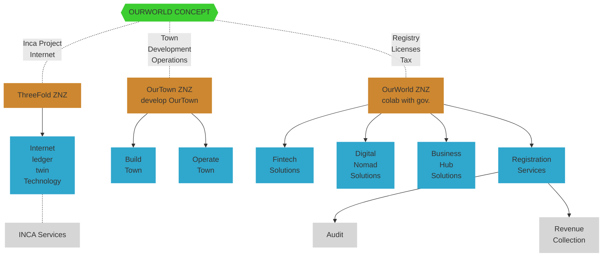

<!-- 
## OurWorld Holding

Plan to do a security token offering in 2023, a part of the shares will be owned by our founders and internal community. -->

## COMPANY ECOSYSTEM

### Responsibilities

