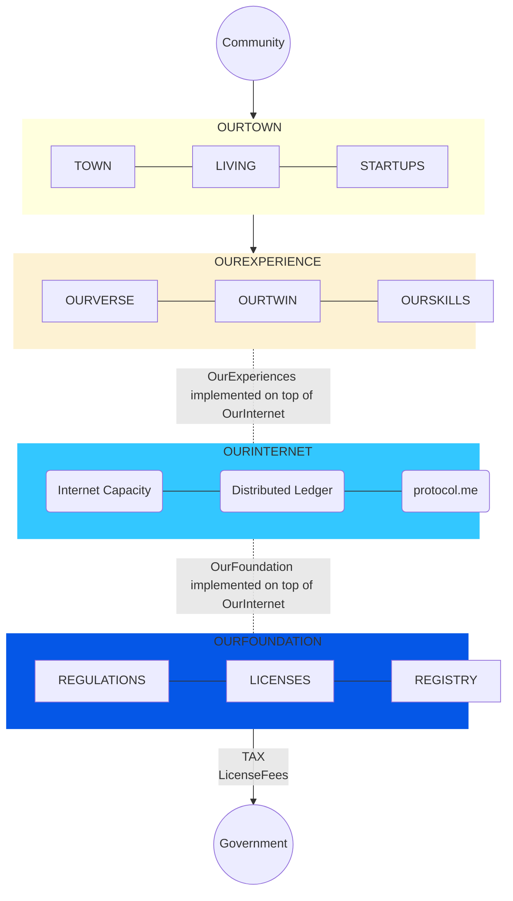

# Our World Layers

```mermaid
%%{
  init: {
    "theme": "light",
    "fontFamily": "monospace",
    "logLevel": "info",
    "flowchart": {
      "htmlLabels": true,
      "curve": "linear"
    },
  }
}%%


flowchart TD

subgraph OURTOWN
    direction LR
    TOWN --- LIVING --- STARTUPS
end

subgraph OUREXPERIENCE
direction LR
    OURVERSE --- OURTWIN --- OURSKILLS
    
end

subgraph OURINTERNET
direction LR
    IC(Internet Capacity) --- LEDGER(Distributed Ledger) --- PM(protocol.me)
    
end

subgraph OURFOUNDATION
direction LR
    REGULATIONS --- LICENSES --- REGISTRY
end


OURTOWN --> OUREXPERIENCE
OUREXPERIENCE -.-|OurExperiences implemented on top of OurInternet| OURINTERNET
OURINTERNET -.-|OurFoundation implemented on top of OurInternet| OURFOUNDATION

PEOPLE((Community))
GOVERNMENT((Government))

PEOPLE --> OURTOWN
OURFOUNDATION -->|TAX<br>LicenseFees| GOVERNMENT

style OURTOWN fill:##FFC300,stroke:#333,stroke-width:0px,width:600,align:right
style OUREXPERIENCE fill:#FDF2D3,stroke:#333,stroke-width:0px,width:600
style OURINTERNET fill:#33C7FF,stroke:#333,stroke-width:0px,width:600
style OURFOUNDATION fill:#0557E7,stroke:#333,stroke-width:0px,width:600


```