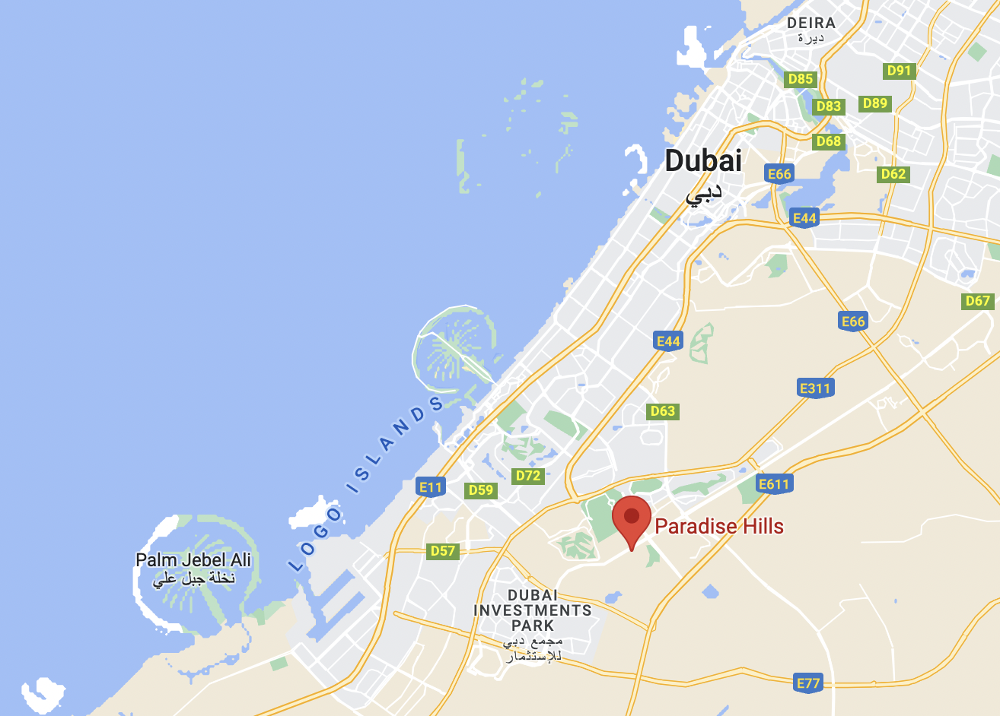
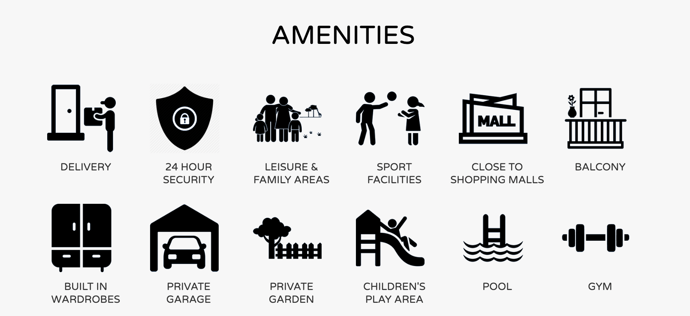
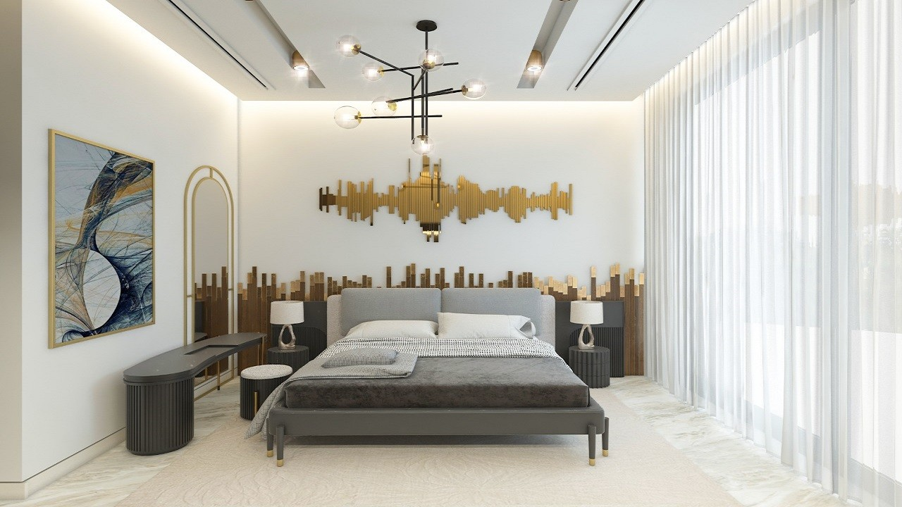
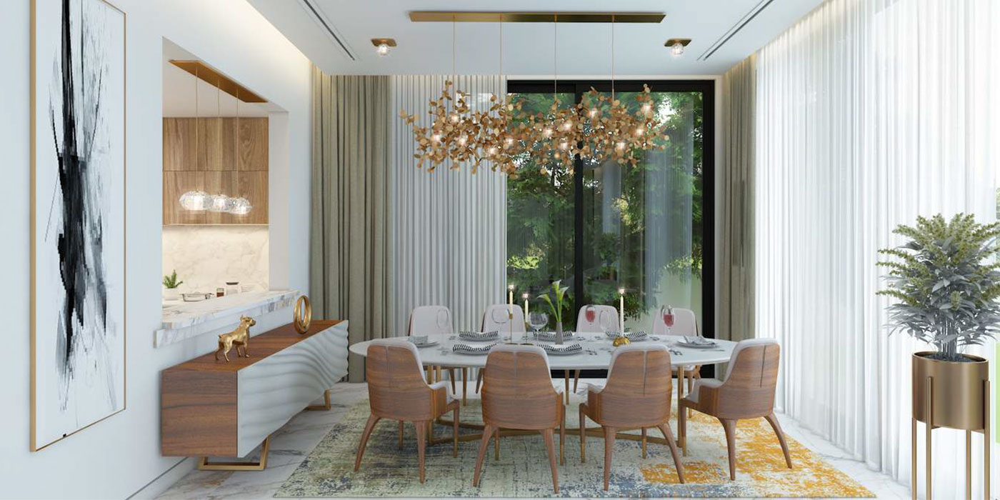
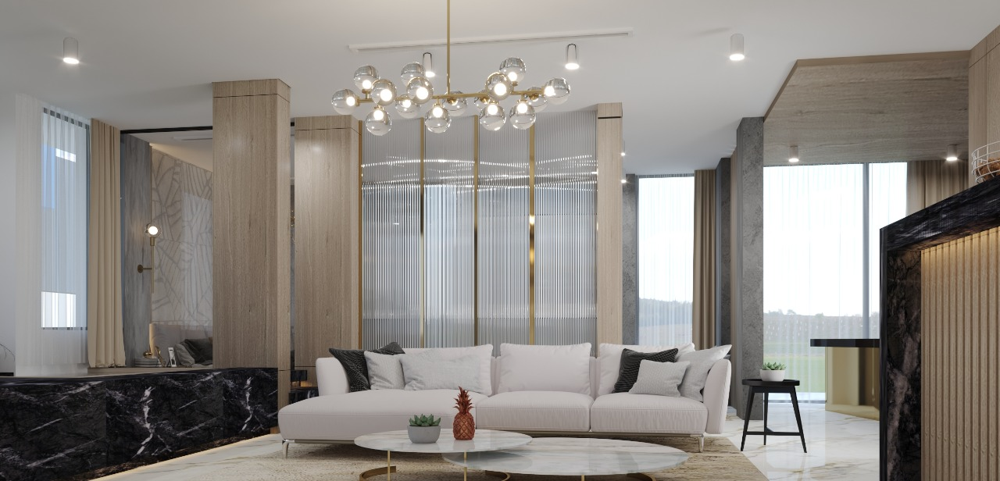
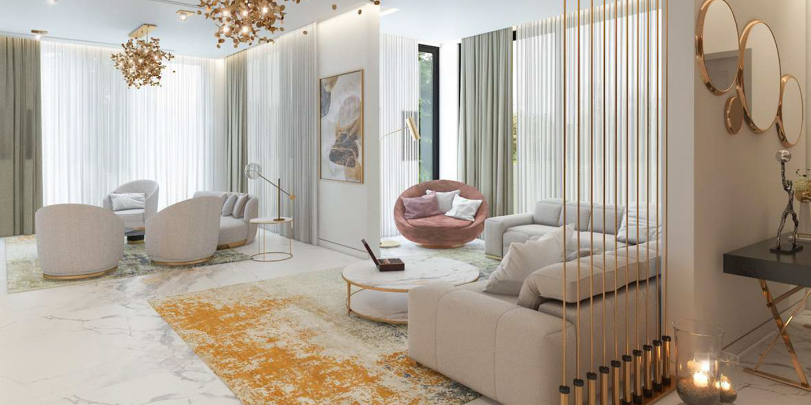

# Dubai Paradise Hills

Paradise Hills is located right within the heart of Dubai and offers a unique luxurious experience. It is an ultra-modern gated community housing 170 pent suites and townhouses, accompanied with stellar amenities and remarkable landscaping in the extensive estate grounds.

## Location

The residences are located on Sheikh Zayed Bin Hamdan Street in Dubai, minutes away from some of Dubai's most valuable locations.

- 5 mins to Jebel Ali School
- 7 mins to Dubai Autodrome
- 7 mins to Aster Clinic Center
- 7 mins to First Avenue Mall
- 10 mins to IMG World of Adventure
- 14 mins to Mall of The Emirates
- 15 mins to NMC Royal Hospital
- 20 mins to Palm Jumeirah
- 20 mins to Al Maktoum Intl Airport
- 25 mins to Downtown Dubai
- 25 mins to Burj Khalifa

  

## Amenities

There are three suites and townhouses, containing 15 rooms, available for digital nomads. Paradise Hills' state-of-the-art amenities include, but are not limited to; community center with retail shops and services, 24-hour security, kids play areas, spacious green areas with water features, jogging tracks, and a dedicated multi-purpose building hall for various occasions and functions such as weddings, international conferences, and events.

  

## Financials

> TODO:

## Aesthetics

Inspired by the ultra-modern architecture, Paradise Hills is a true representation of fine landscape craftsmanship at work. The lush and open landscapes amplify the common theme of tranquility and luxury within the community.

