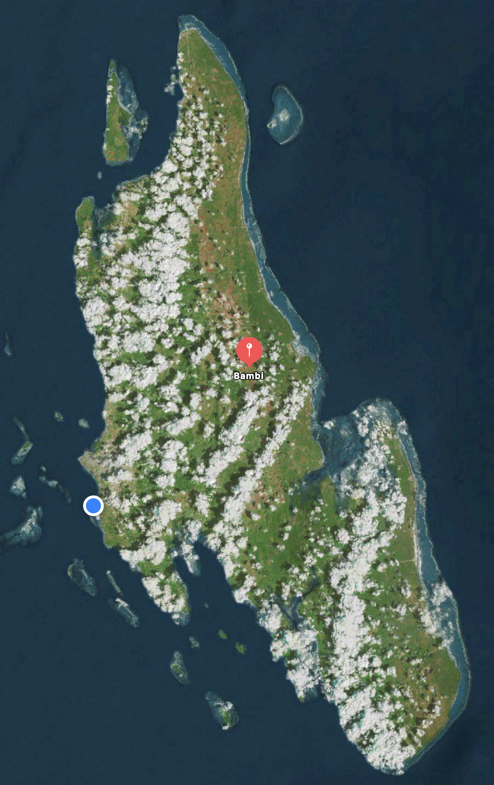
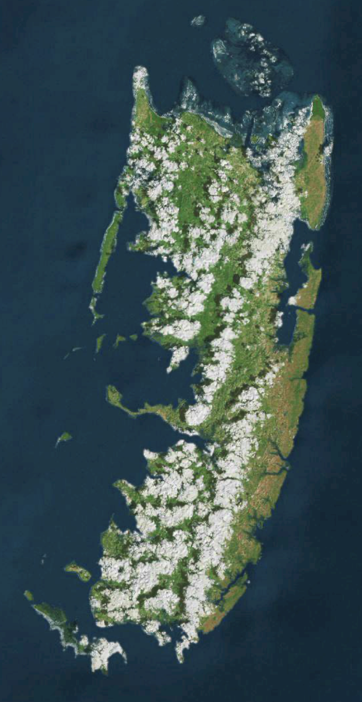

# Zanzibar Farmlands
Up to 500,000 square meters of land is planned to be acquired. Our team is still scouting for more farmlands across the Zanzibar archipelago. Many pieces of land are identified and we are in contact with the relevant authorities for further acquisitions. 

## Location
Even though the identified farming lands are in many locations in Zanzibar, we plan to acquire a majority of the land from Bambi in Unguja Island and Pemba Island. **The first land in Bambi has already been purchased.** The first land is a small 2-acre land that allowed our team to get familiar with Zanzibar regulations around land transfer. The location will also serve as a test ground for the expected farming activities on the acquired farming lands. 

### Bambi
Bambi is one of the most fertile regions of Zanzibar for agriculture. It is located roughly in the middle of the island. It is 25 km from Stone Town and is close to many other touristic facilities.

  

  

### Pemba
Pemba Island is the second largest island in the Zanzibar archipelago. Similar to Unguja Island, Pemba also has many fertile regions suitable for farming. Our team has visited multiple plots in Pemba and identified fitting plots. 

> TODO: some pictures (can be from other plots), size, ...

