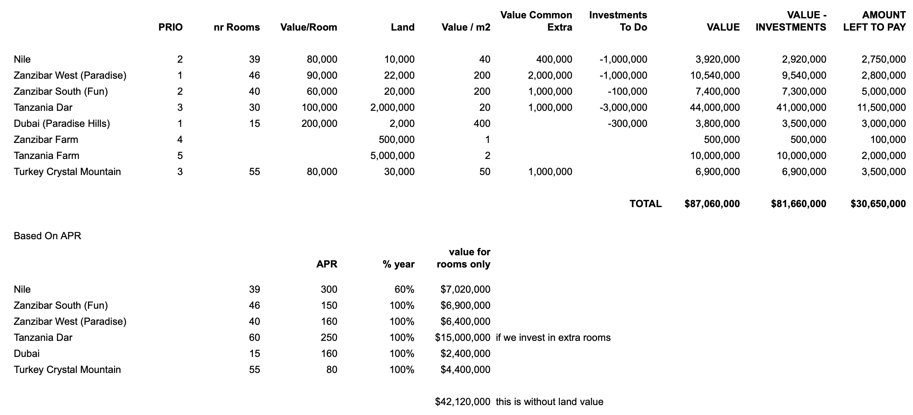

# Valuation Excercise

  

The valuation exercise above makes the opportunity more clear. Locations are listed with their priority. Number of rooms for each location is listed. Room and land values are calculated seperately to have an estimate of the total land value. Extra amenities within the locations are added to the total value from the "Value Common Extra" column. THe amount of investment that need to be done on certain locations for renovations or development are also listed. 

The last column shows the amount to be paid to acquire the identified assets. **It is shown that the estimated value of all the locations combined of $87 million is significantly larger than the amount needed to purchase the assets, which is $30.65 million. This is the big opportunity that brought this project alive.**

Another valuation exercise was done on the bottom based on the APR to reflect the value of the rooms that the DAO will own. The estimated value of the rooms is shown to be $42.12 million. This value exludes the value of the land. 