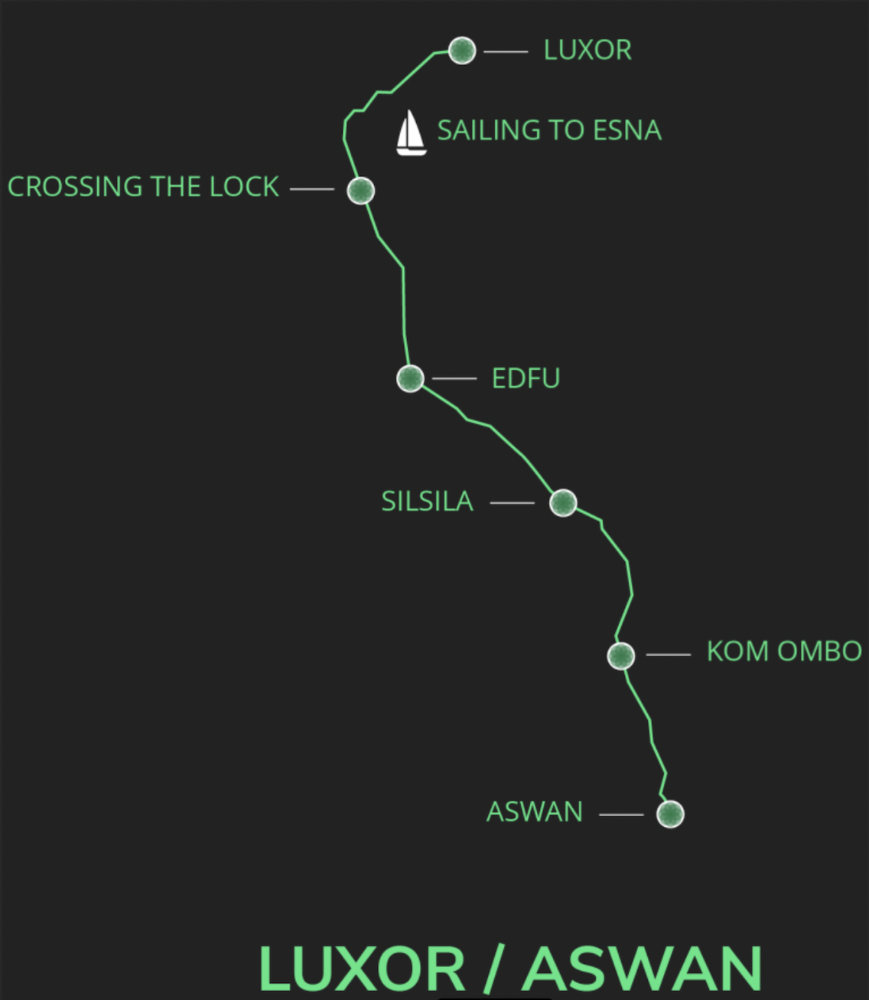
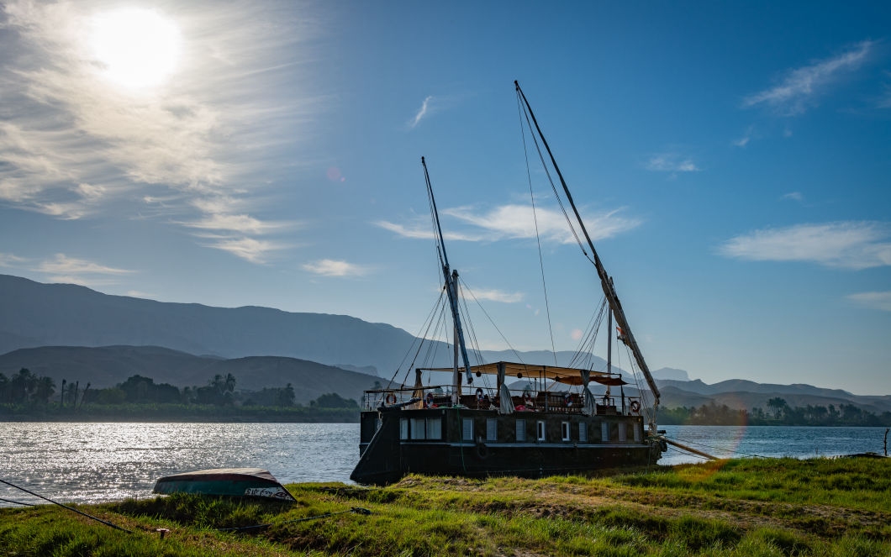

# Nile Luxor
Dahabiyas are traditional sailing boats used on the Nile river. This location includes four dahabiyas that offer peaceful and organic platforms for its visitors. 

  

## Location
The boats are located on the Nile River in Luxor, Egypt. They are originally designed for private trips along the Nile offering a unique and authentic experience with organic food, green energy, and a warm-hearted crew. 

  

The dahabiyas can host visitors in Luxor or host them on trips along the Nile. 

## Amenities
The four dahabiyas total have 29 rooms and 10 suites that can host up to 78 people. Each room has a private bathroom. All boats have clean, modern and authentic communal areas for relaxation and co-working. 

 

 

### Veda 1

 

This 50-meter dahabiya has 6 rooms and 4 suites with private balconies. It has two air conditioned meeting space for up to 50 people including an upper deck meeting room with a 360 degree panoramic view of the Nile. There are multiple places for relaxation, for workshops / yoga or meditation. It also includes a nice library with a collection of Egyptian history and awareness books. 

### Veda 2

 

Veda 2 has 8 rooms and 2 suites with private balconies. It has a large and cozy upper deck divided into several areas: sun bathing, beduin corner, and dining area. The sun deck space is fully customisable according to the needs of the visitors such as digital nomads. 

### Veda 3

 

Veda 3 is a cozy 18-meter dahabiya offering a peaceful floating home for smaller groups of people. It has a total of 5 rooms and can host 10 people. It has amazing Nile views on a cozy upper deck. This dahabiya can also be customized according to the needs of the visitor. 

### Veda 4

 

Veda 4 is the newest addition to the dahabiyas. It is a 55-meter dahabiya with 10 rooms and 4 suites.  It has a large upper-deck and meeting rooms as well as several relaxation areas. 

More information about the dahabiyas can be found in https://veda-egypt.com/index.html. 

## Finances

>: TODO

## Gallery

  

  

  

  

  

  

  

  

  

  

  

  

