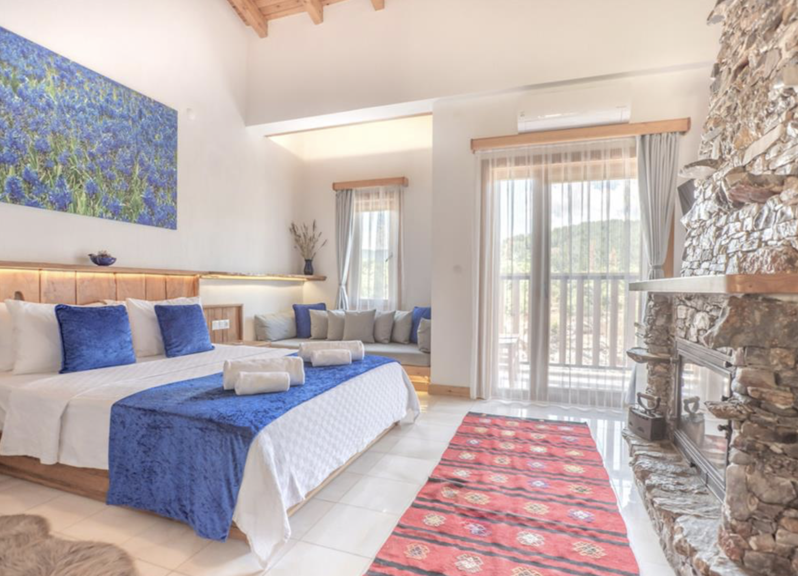
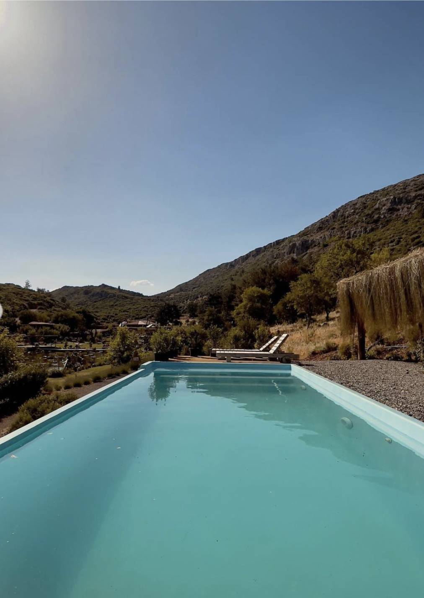
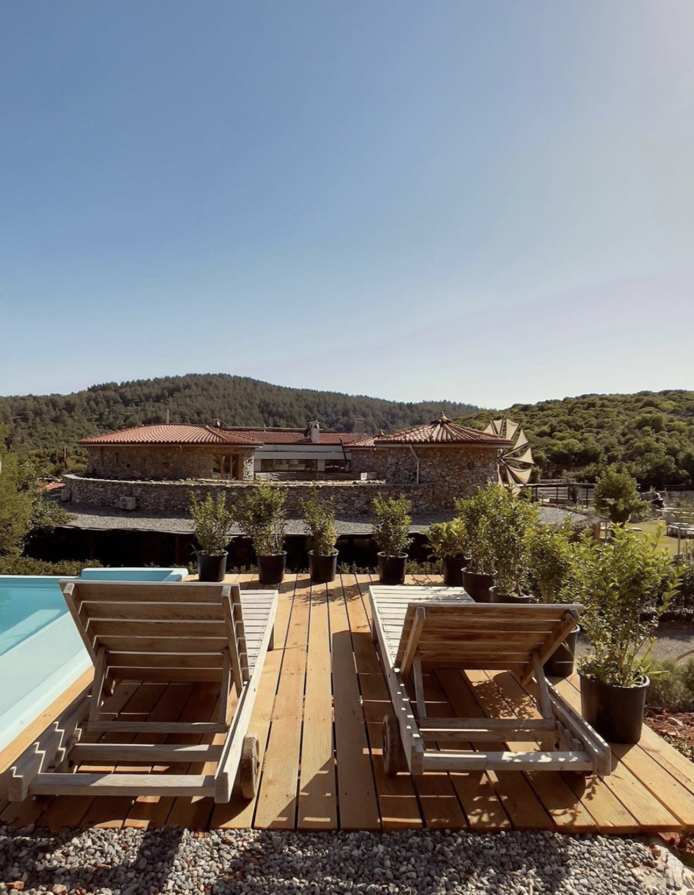
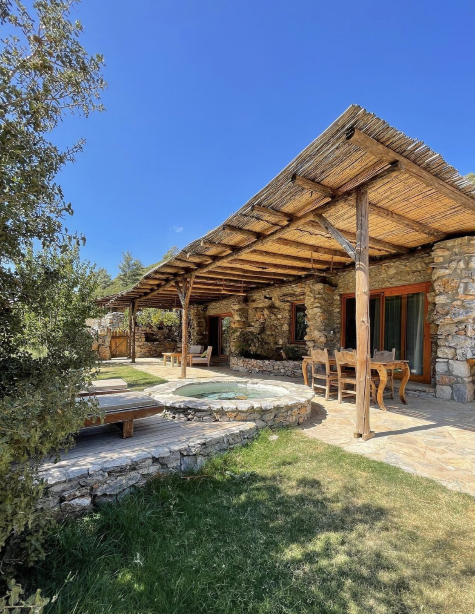
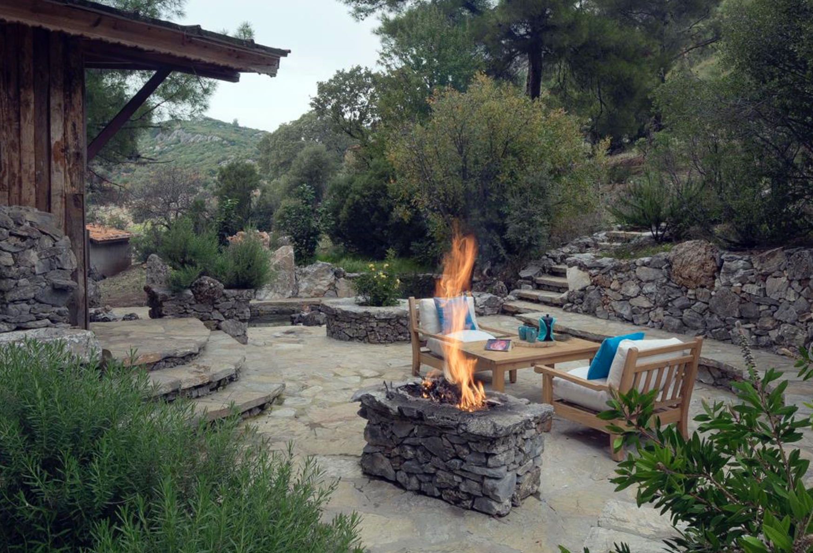
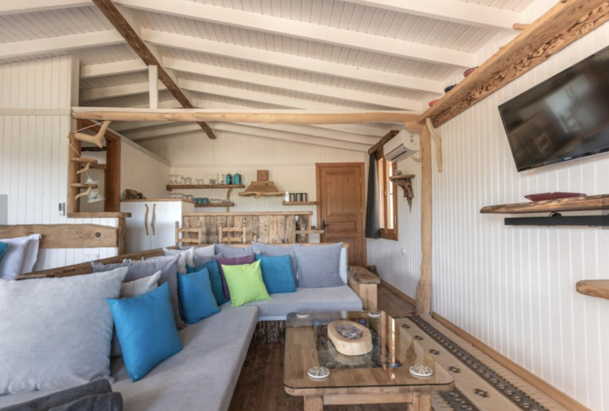
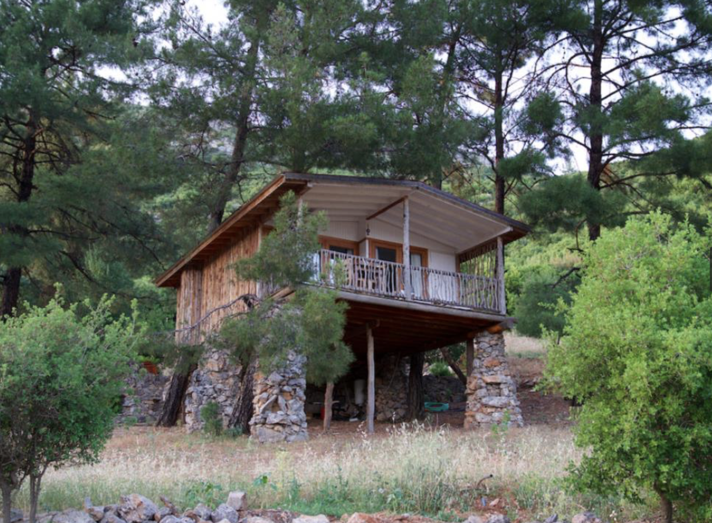
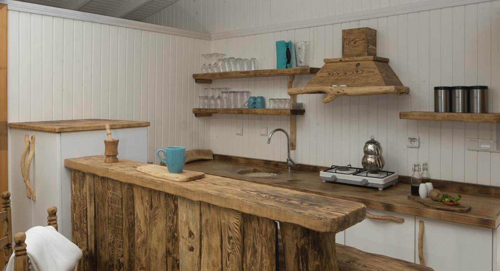
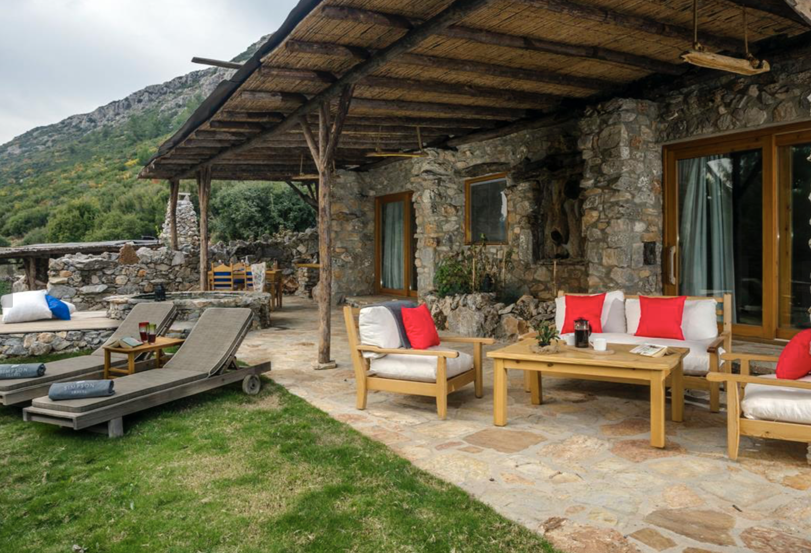
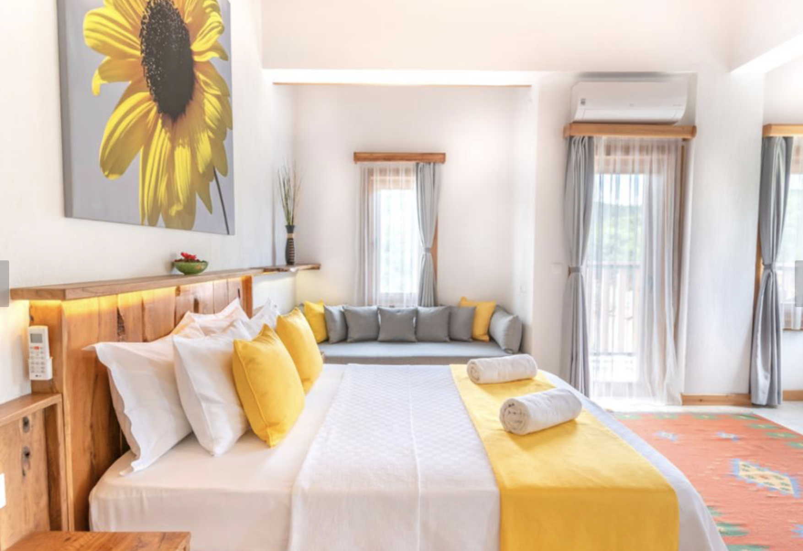

# Turkey Yenice Valley
The concept of Yenice Valle grew from a love of traditional Turkish village life and the desire to sustain our natural environment.

Yenice Valley has come to reality in a quiet and secluded valley, surrounded by tree-covered mountains, with accommodation built using traditional local materials. It includes a treehouse, stone cottages, and a log cabin, each in plenty of space, well-furnished and fully equipped. 

The focal point is a stunning stone-built boutique hotel, which is harmoniously nestled into the surrounding countryside. The valley is surrounded by an abundance of trees including pine, almond, olives and fruit trees, all of which attract a wonderful range of wildlife including birds, boars, squirrels, hares, tortoises and goats. Hiding away in the valley gives everyone a wonderful opportunity to experience nature at its best.  Waking up to the sound of bird song, peaceful evenings on the verandas and exploring the amazing countryside whether on foot or by car provide the perfect sanctuary.

  

## Location

Many communal areas are present in the space that can be customized according to visitor's needs. It's located in Mentese, Mugla in the south of Turkey. It is close to many other Turkish coastal towns that attract digital nomads. 

Dalaman Airport
- 80 mins away from Dalaman Airport, which serves airports in London, Germany, Holland, Switzerland, Russia and more.
  
Izmir Airport 
- 150 mins away from the larger Izmir Airport, which serves many locations across Europe and the Middle East.

  

## Amenities
Yenice Valley has 55 modern and authentic rooms. There are various room options for different audiences. In order to be as close as possible to traditional Turkish village life, the valley includes organically grown vegetables, with a greenhouse to lengthen the season. At various times of the year you will find tomatoes, peppers, aubergines, okra, broccoli, cabbage, onions and spinach to name but a few! The development has their own special olive oil which is pressed from the harvest of the family owned olive grove.

The location also offers a number of recreational activities from swimming in the 25m pool to yoga and other welness retreat activites.

### Food

Each morning guests can be woken up to a traditional Turkish village breakfast ‘köy kahvaltı’. This breakfast includes local cheeses, home baked bread, tomatoes, cucumbers, peppers, olives, jams and honey. 
 
The location's in-house chef also prepares delicious dinners based on seasonal produce available locally and on site. The selection includes various hot and cold mezzes, his special mouth-watering guvec, cooked on the open fire, and much more. 

## Gallery
  
  
  
  
  
  
  
  
  
  
  
  
  
  
  
  

