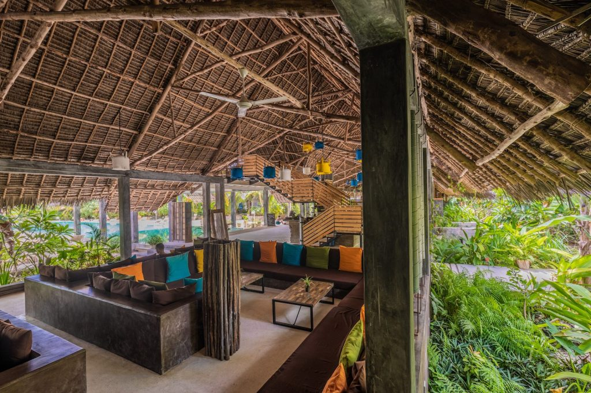
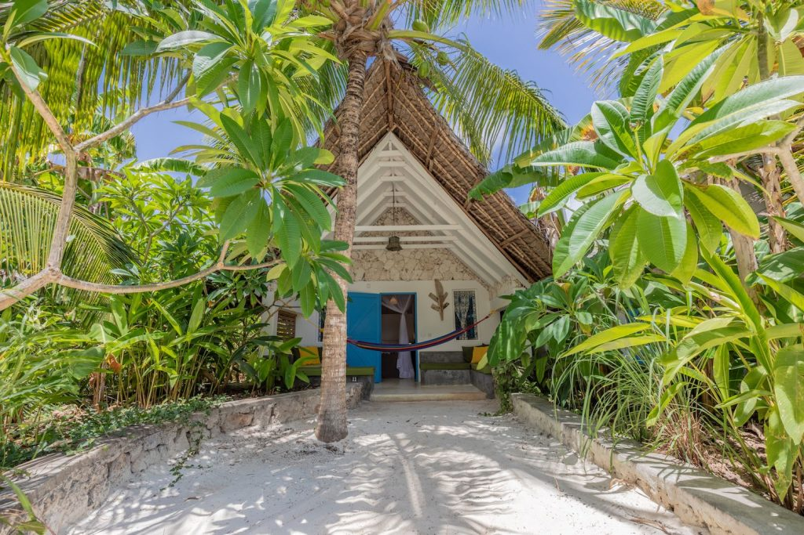
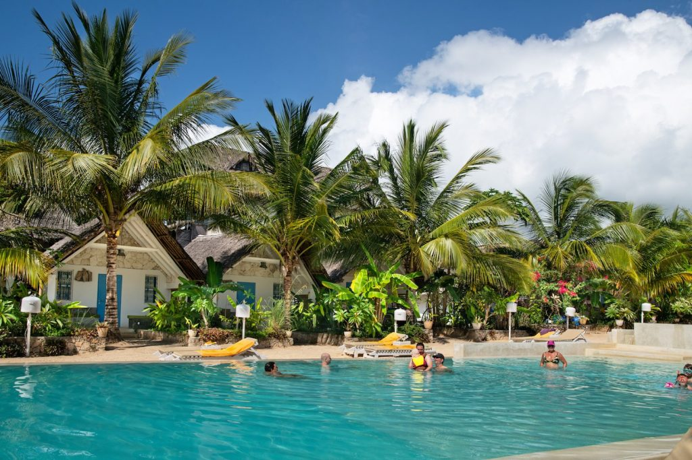
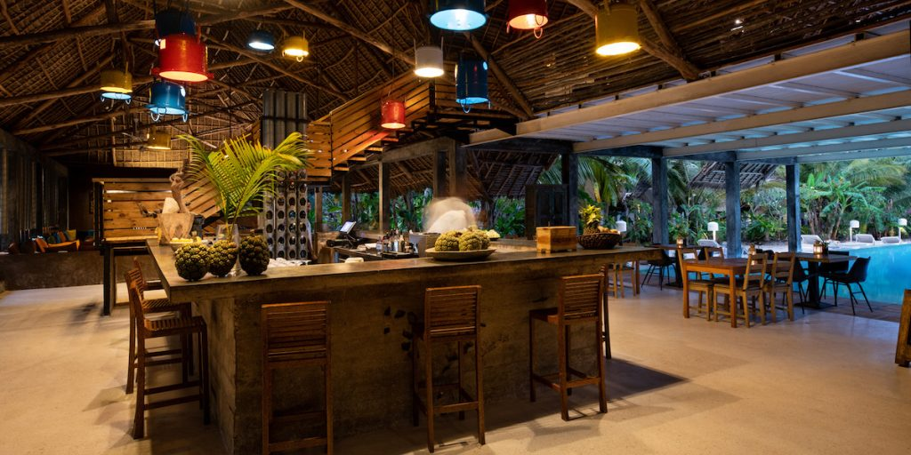
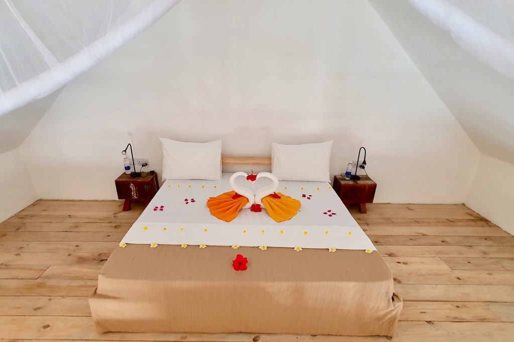
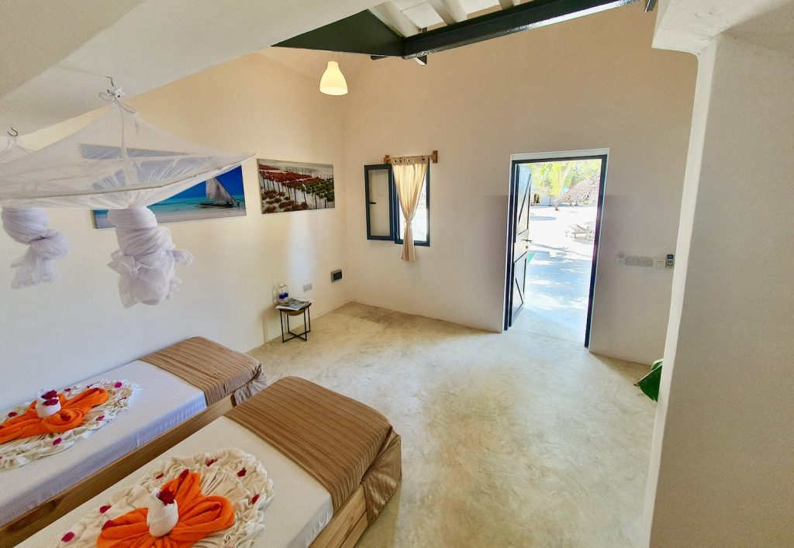
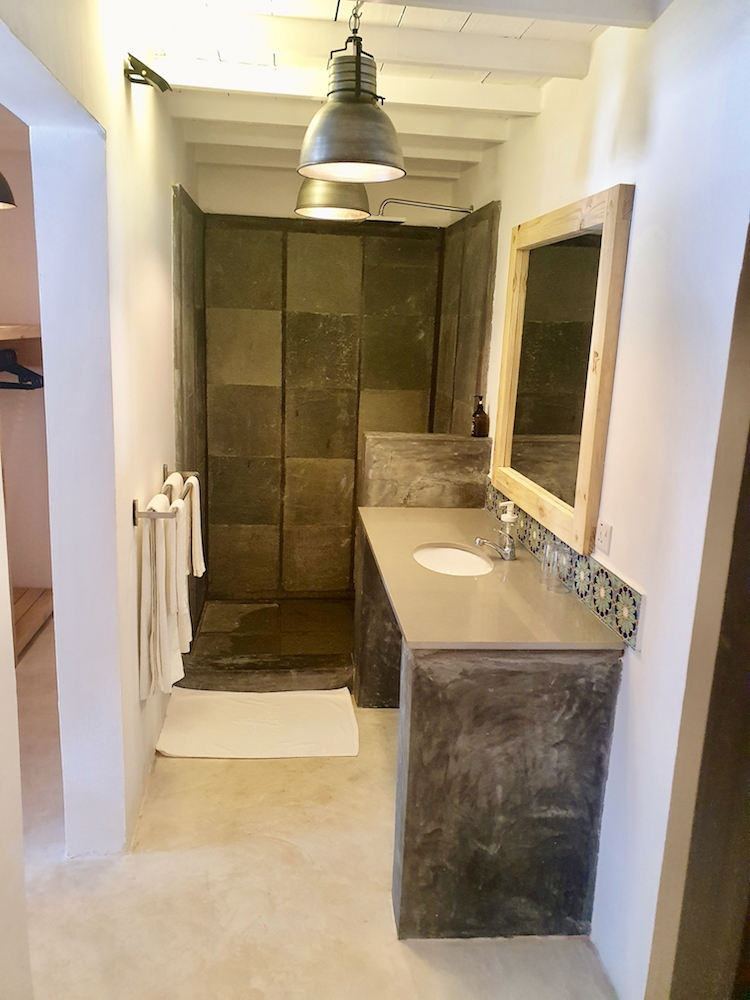
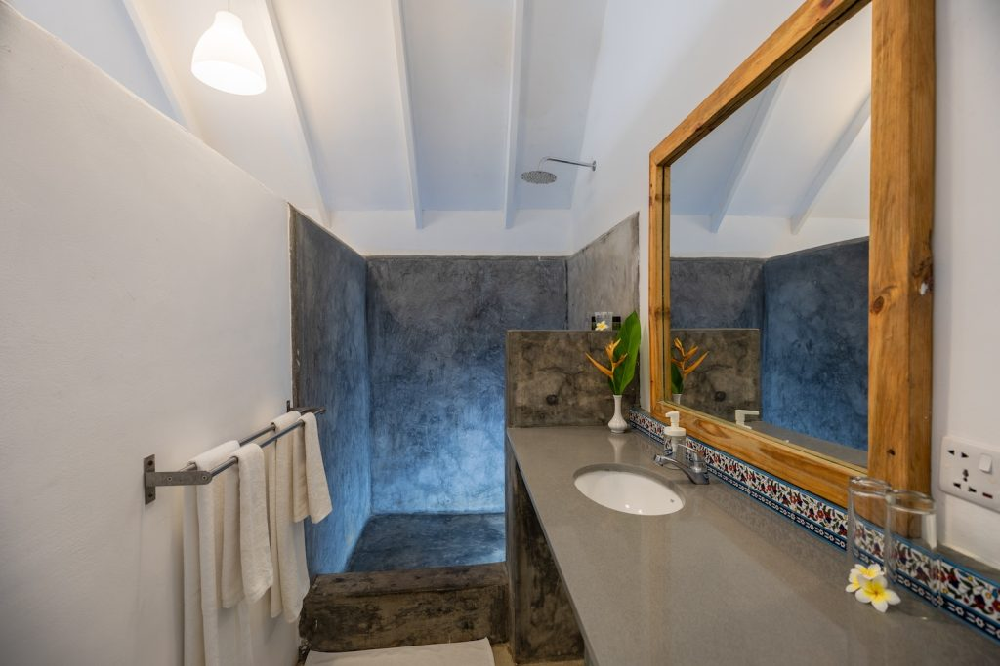

# Zanzibar South - Fun

Fun Beach is a beachfront property in the south-east of Zanzibar which provides a far more relaxed, holiday vibe. 

## Location 

Fun Beach is located between Jambiani and Paje in Zanzibar, an ideal location in close proximity to the Zanzibar nightlife but sufficiently far from the busy tourist hot spots, therefore a perfect fit for digital nomads.

  

## Amenities

At the Fun Beach location, there are 42 rooms available to be used.

The top class restaurant offers breakfast, lunch and dinner in a range of cuisines - international, Indian, Arabian and more. 

There are two pools, sized 26m and 27m, on the beach front of the property flowing into each other. They provide a full view of the Indian Ocean. There is also a pool in the centre with small islands and sitting areas.

The games room features billiards, ping pong, and a football table in addition to a TV and library area. Throughout Fun Beach there is ultra-fast wifi connectivity.

A range of spa treatments are provided by the oceanside against a therapeutic backdrop of light, wind and waves. Individual treatments, or packages with treatments ranging from massages (deep tissue, gentle and relaxing) to facials and manicures are available.

Below is a sitemap, showcasing the different facilities in the property.

## Gallery

