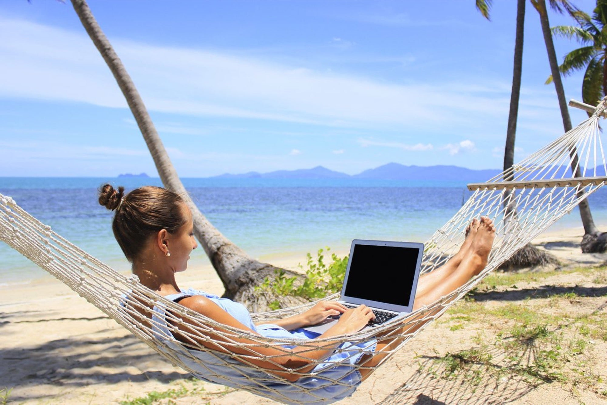

## Digital Nomads Benefits

  

### Benefits for Zanzibar

**Zanzibar is beautiful and that quality needs to be preserved; getting other sustainable sources of income can help that process.**

Zanzibar OurHub will be a sustainable business & incubation center.

100% sustainable, with zero damage to the local environment, culture or economy.

The revenue generated from the Zanzibar Digital FreeZone can be used for:

* Promotion & growth of the Digital Freezone
* Incubation of more projects, which creates value for the Digital Freezone.
* Development of sustainability projects.
* Support of local community around the Digital Freezone
* Government functions

### High Tech In Zanzibar

World class IT systems will provide: data sovereignty, transparent reporting, productivity tools and a conscious tech hub.

### Healthy Tourism = for digital nomads

A certain percentage of the digital nomads will spend some time in Zanzibar, this leads to secondary benefits for Zanzibar (Tourism).

### Modern Sustainable Physical FreeZone location for digital nomads

See OurTown section (cybercity)

### Benefits for Digital Nomads

#### Zero Complexity

Our unique digital twin IT system allows a digital nomad to simplify his personal business life.

#### Quality of Life

Within OurHub, nomads will have the following capabilities:  

* Communication (messaging, email, video conferencing)
* Invoicing, Expenses, Accounting and other administrative tasks
* Data Storage (all  data is stored securely online)
* Contract management with employers, business partners and service providers
* HR relations
* Personal and collaborative project management
* Digital currency wallet 

Every task  is 100% automated and peer-to-peer with business counterparts, requiring no manual action. For example, invoices are generated and sent digitally and securely (and permanently recorded on a blockchain).ß

#### Preparation for an unsure future

Whatever might happen in the nomad’s homeland, their company and assets are safe and secure in a well-regulated online environment. New capabilities will be added over time as OurHub expands organically and its growth potential  is clear.

In particular, as the use of token-based currency models (security tokens, utility tokens, digital currencies) grows, OurHub will provide this capability for its communities. 

Prepare for the future, digital tokens will become increasingly important. 

#### Convenience and Collaboration: Multiplying efforts, not adding them

Find like-minded innovative partners, collaborate to build bigger projects with least effort and maximum protection. Attract like-minded entrepreneurs in Zanzibar.

Together create a better world. Zanzibar can be the home for a digital ecosystem of like minded digital nomad entrepreneurs. Use powerful collaborative Ourworld tools all hosted in Zanzibar.

### For The Planet

We maintain a strong set of values to make sure that we do our business to the utmost ethical standards.

