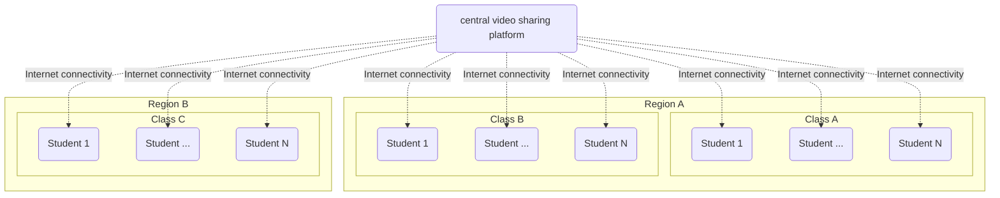
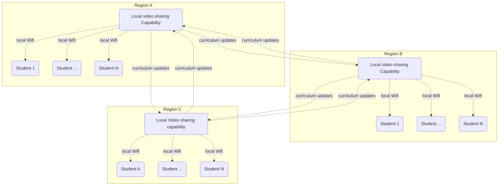
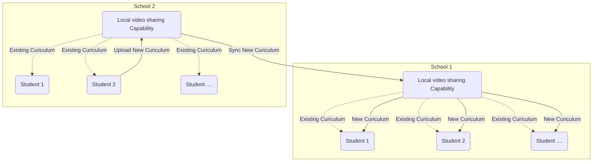

## Education

Education is a sector that still relies on traditional teaching methods, a teacher, a classroom, a black (or white) board, books, paper and pencils.  This method has been in use for hundreds of years.  In this digital age there the classroom can be a digital classroom, with a teacher teaching and all of the rest of the required items can be digitised as well.

Traditional learning is based on a live teacher, teaching an audience in a classroom. This works, however is has a number of restrictions which makes that work for a limited number of pupils, and not everywhere because of the necessity to have live teachers and pupils.  In this digital world we can record end present the learning materials in a digital manner to a much larger audience that a single classroom.  Classes, or better while curriculum can be digitised and share along a much larger group of pupils spanning a vast geographic area.

The Covid-19 pandemic has proven that remote teaching is possible and that the current technology allow for this.  This experience was still based on the standard teacher - pupil relationship and numbers for live teaching.  Another technology, a video sharing platform has proven that storing videos and sharing videos is a effective manner to reach a very large number of viewers (youtube.com).

Taking the learnings from both of these current use cases we have created Sikana. Improve your life - one skill at a time. Sikana is a free education platform, with more than 4 billion views, aiming to deliver quality education and necessary skills to everyone. The software can be installed on threefold nodes and deployed regionally so that bandwidth requirements are minimised because it is a decentralized online education platform.

To scale such a solution for many classrooms in many schools and in many different regions puts enormous requirements and stress on the central video sharing platform and on the internet connectivity available in the education locations.  Every individual student will initiate a single connection to the central video sharing platform.  This might overload the existing connectivity setup of a school or even a regional in a country.

Decentralized video sharing for an education platform will lower the requirements on the platform and creates, stores and distributes educational content from within a region, or even from within a school local to that location.  This allows such an education solution to educate everywhere, even if there is poor )or no) internet connection. A simple wifi router that connects devices to the educational platform is all that is needed.

Such a decentralized platform make access to a lot simpler and improves on operational and connectivity costs.
- if decentralized platform is inside a school building normal local WiFi is all that is needed to provide the curiculum to students. 
- relative small amount of internet connectivity is needed to synchronize and update content of the different platforms.  Students might and new materials or learnings in location A which then needs to (or can) be shared with the other individual platforms.

To data such a platform has delivered 4 Billion courses to student in (predominantly) South America.  The content stored and distributed in the platform is in the order of 3000 Videos.  These videos and are stored locally on the platform and can be shared with the student by local WiFi connections.  

Additional content can be submitted by students and use as additional learning material.

