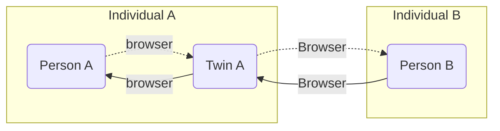

```mermaid
graph LR
    
    subgraph Individual A
    INDIVIDUALA(Person A)
    INDIVIDUALA .->|browser| TWINA
    TWINA -->|browser| INDIVIDUALA
    end
    TWINA(Twin A) .->|Browser| INDIVIDUALB
    subgraph Individual B
    INDIVIDUALB(Person B) -->|Browser| TWINA
    end
```