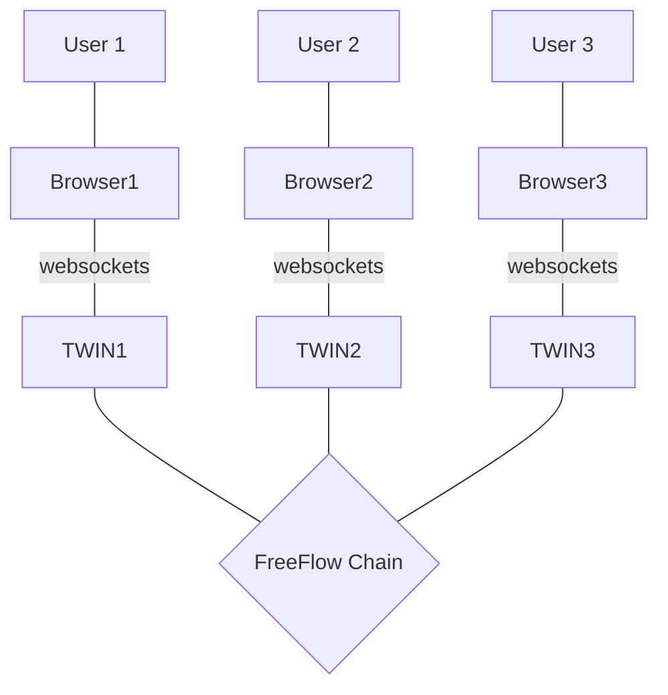

# FreeFlow Chain Architecture

The FreeFlow chain will be based on to be chosen blockchain.

The blockchain will provide following functions

- identity management
    - kyc verification (with link to 3e party providers)
    - DID support
- circles
    - people get grouped into circles
- authentication/verification
    - proof of authenticity
    - audit log of security events
- DAO features
- Address Book (like a sort of phonebook)
- Financial Management/money as relevant for this product
