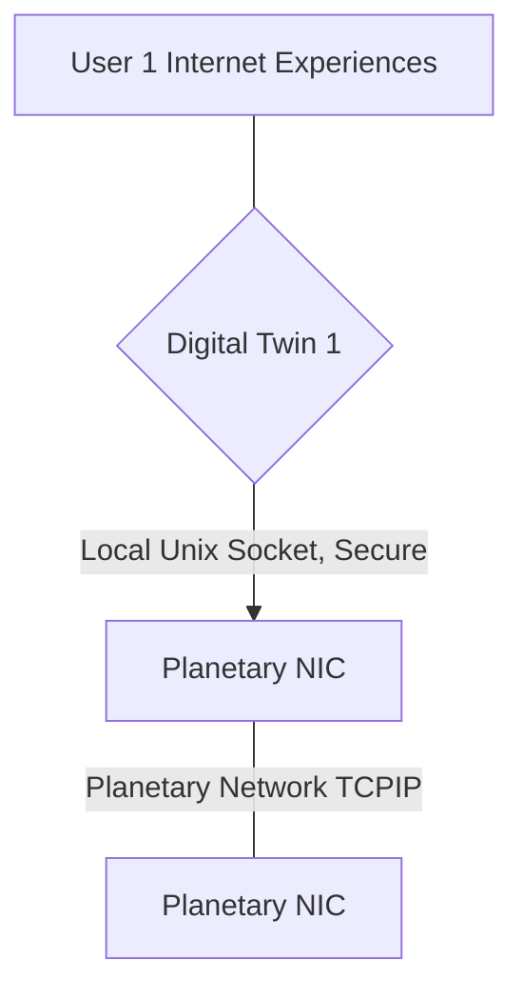
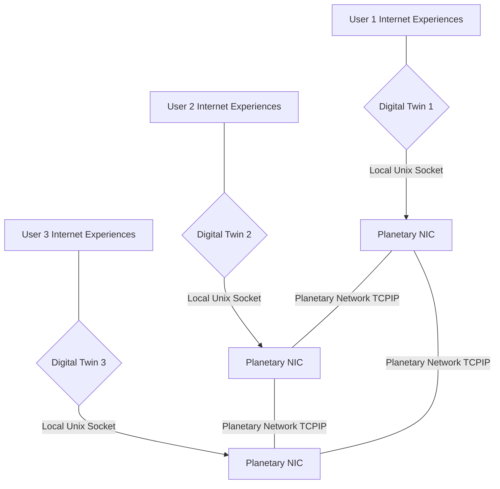

# Architecture Planetary network

The planetary network (originally based on an opensource project yggdrasil, but will be extended as described in this grant) will have following features

Each endpoint of the Planetary Network is called a Planetary NIC (PNIC)

- Reliable Message Bus (integrated in PNIC)
    - can send in super reliable way messages between the digital twins
    - messages can be types, so strong verification happens (complex types supported)
    - supports serialization based on CAPNP (https://capnproto.org)
- Communication over UNIX domain sockets / websockets to the 
- End2End Encrypted Messaging
- Each PNIC has private & public key (unique globally)
    - addressing happens based on public keys globally
- Self healing (if 1 link goes down it will look for other interface)

## Twin to Planetary NIC

The planetary nic is part of our planetary network (see https://github.com/freeflowuniverse/freeflow_network). Each NIC allows the twin to talk to a local interface of the planetary network.

- NIC stands for Network Interface
- Each NIC has following functions

## Twin to Twin Communication

## Reliable Message Bus

Is an integrated part of the Planetary Network and its PNIC.

