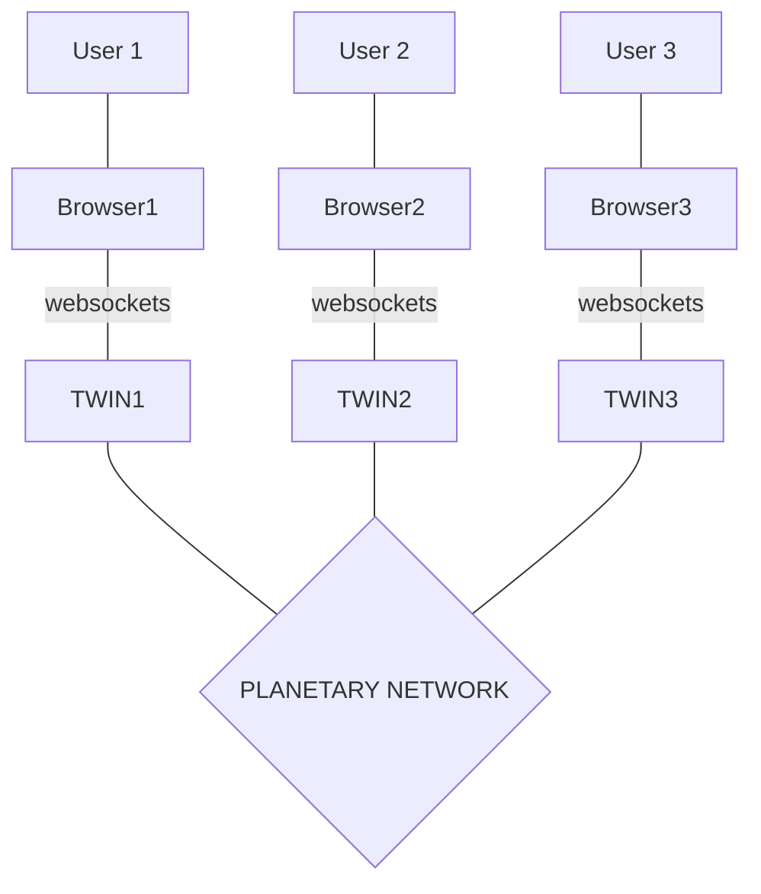
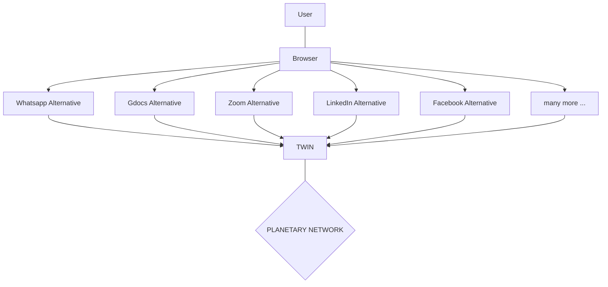

# Architecture Twins

Each user has a digital twin, the user interacts with the digital twin through e.g. a browser but in future can be voice, chat, metaverse exerpience.

- Each digital twin is private for the user and only the user has access to it.
- The browser communicates over websockets (private and encrypted) per user to their twin.
- The twins talk to each other over the planetary network

## Experiences

## Each twin has multiple experiences

Some example applications ready to be launched on top of the digital twin, it requires the purpose of this grant which is an improved communication mechanism between the twins.

### Metaverse

  

### Gdoc/Whatsapp/... alternative

  

