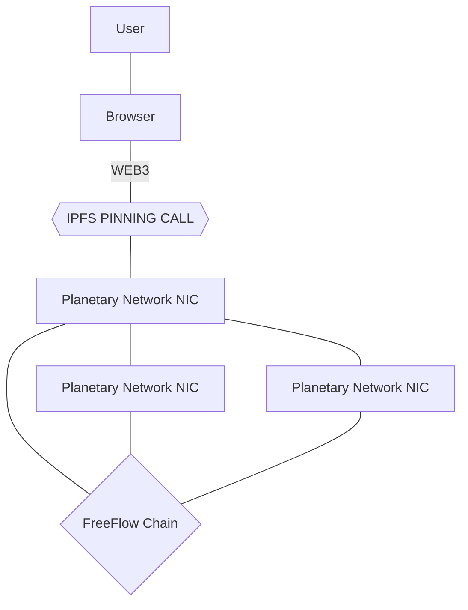

## Milestone 3: Integrated storage primitive based on IPFS.

NFT's are a serious usecase of decentralized systems but its hard to do a proper integration.

The purpose of milestone 3 is to implement an IPFS pinning service as part of the Planetary network.

The pinned data can belong to 1 user or multiple users at once.

## Acceptance criteria for milestone 1:

* [ ] basic features
    * [ ] pin IPFS files on TFGrid using planetary network
    * [ ] integration with chosen blockchain (auditing/metadata)
    * [ ] each node can be used to retrieve the files
* [ ] performance / Scalability
    * [ ] 100.000 files can be stored on the network
* [ ] redundancy
    * [ ] files can be stored multiple times on the network
    * [ ] files can be retrieved through multiple locations
    * [ ] if a node goes down but pinning happened on multiple nodes, file cannot get lost
* [ ] payments
    * [ ] users can pay for their storage requirements
    * [ ] billing for used bandwidth
    * [ ] users can topup 
    * [ ] users can see if they still have money left for their storage requirements
