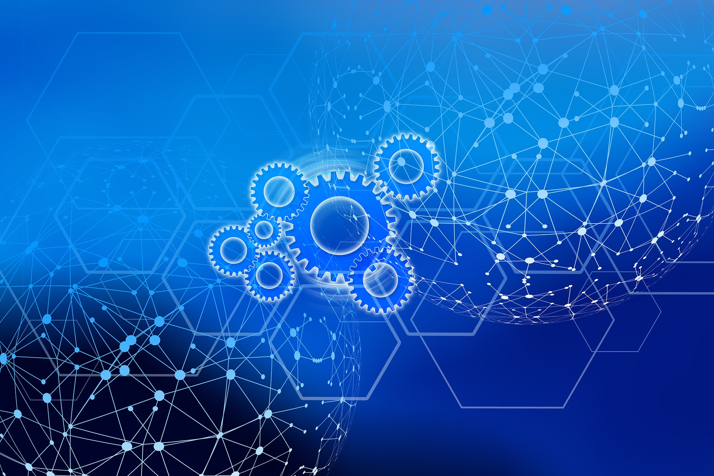

# OurWorld = an abundance based Internet of Internets system

Our beautiful world has become a crazy place with lots of changes. Do you want to be part of a movement which is making real change and which has a purpose to resolve some of the biggest issues in the world? We are a grounded movement, actions first. We have a practical executable plan and all required tools. Our practices are regenerative, spiritual and high tech.

There is a lot of talk in the world, we believe the time for talking is over, we need action and we need it now, our planet is a super beautiful place, we don’t want to take it for granted we want to fight for it. The Internet was a beautiful place 30 years ago, we want it back and we believe a better internet is an instrumental tool to make us free again, to allow us to all together create a better world for ourselves and our children. The internet is now owned by very few, and we became a product in a too capitalistic system.

It all started with a group of crazy people and “nerd” engineers, who decided to stop talking and just build a new system. We didn’t ask for permission, we didn’t do a crypto ICO with lots of promises, we started building. 

With the help of more than 80 investors and thousands of project supporters we have been able to build a lot and  \
are working on even more:

* A new internet infrastructure platform (fully peer2peer and decentralized, and super reliable) = ThreeFold
* A new decentralized and regulated finance & digital asset exchange system, based on values (work in progress)
* A set of incredible experiences, with the ability to provide digital freedom for all our online requirements.
* An upgraded economic system platform where no money needs to be paid to offer or find information,  \
where lock-in does not exist.
* A Digital Twin system which is the base of Banking and Web 4.0, a new way to communicate, share, collaborate
* A decentralized healthcare & education system

More than 50m USD has been invested so far, we have a very active community of hundreds of contributors and we are working with some governments to deploy the system in their country.

We are excited about a future where we can together create a more safe platform, based on values, transparency and love. Not in a talking way, in a super practical can do mentality with concrete plan. We are doing it, join us… become part of our movement.

**The world is changing in front of us, we cannot deny it and we need to act now.** \

We are in the forefront of a growing movement, more and more companies want to prioritize people and planet positive policies. We are not swimming against the stream, we are part of a group of leaders of change and making real the zeitgeist of the 21st century. 

Companies and investors that fail to be part of this needed movement will seem like dinosaurs by 2030 and be valued by our communities accordingly.

# REGENERATIVE PLANET AND PEOPLE FIRST APPROACH

<table>
  <tr>
   <td>

   </td>
   <td>We believe in:
<ul>

<li>Planet First

<li>People Second

<li>Profit As Result

Anything we do needs to improve our planet's situation (climate change, regenerative, respect resources, …) and help the people around us. As a result of doing so, we as investors of time and money will have created most value and will get the benefits from our efforts.
</li>
</ul>
   </td>
  </tr>
</table>

Read more about our mission in [http://mission.threefold.me/](http://mission.threefold.me/) 

# 

# WE ARE ALREADY IN THE MATRIX, LET'S GET OUT.

Today most of us are living as slaves in a big system without realizing. This system is based on money, money is the biggest drug in the world right now. Money by itself is not bad, it's the way we use it today as the fuel of our current limited system. We like to think about money as ‘frozen time energy’. 

Today, this ‘frozen time energy’ mainly flows from the ones who don’t have enough to those who already have plenty. \
There are 3 main mechanisms which make this possible:

1. Interest
    1. Example, in Germany 40% of any product you buy covers interest related cost (compound)
    2. It's also a mechanism to enslave people and countries. Compound interest is a real problem.
2. Marketing / Promotion 
    3. For a retail product, up to 50% goes to promotion.
    4. Is promotion in our interest? What's wrong with the little post-it note on the whiteboard of our supermarket, that was an (cost) effective way to find something.
    5. Current system is about creating new desires by exploiting Data with the most advanced psychological and neuroscience discovery to hack our brain and play with our tensions, vices and pulsations... rather than answering our essential needs in a healthy way.
3. Lock In and Intermediaries
    6. We are locked in by websites or products of large companies, this leads to power centralization.
    7. Many find themselves in a trap where they barely benefit from the products they produce, an example is gold, bananas, coffee, … less than 5% goes to the producers.

**All of this together means that we keep less than 10% of our economic output for our own benefit, we could argue that this makes us officially a slave of an unfair system. More info in **[http://thematrix.ourworld.tf](http://thematrix.ourworld.tf) .

What if we together create a new type of Internet not based on scarcity and fear, but based on trust and abundance? A system which gives everyone equal chances and allows us to together create a new world called “OURWORLD”. \

**OUR SOLUTION:  \
an abundance based OURWORLD. \
 \
**

OurWorld (using ThreeFold Technology) allows us to co-create our own digital future together.

Imagine a world 

* Without a need for manipulative marketing, everything can be found for free and is equally available…
* Without exchange fees, everything can be exchanged for anything without cost.
* Without interest, we together create a stable internet currency to fund our own future.
* Without lock-in or manipulation, no deep fakes, a tangible reputation system protects us.

Imagine a digital currency

* Backed by the fastest growing commodity in the world = Internet Capacity
* Co-owned. We all together generate this currency by generating this Internet Capacity.
* Carbon negative, remove carbon from the air, as compared to wasting energy to mine a token.
* Globally available as a real utility token.

Imagine an economical system

* Which allows us to generate 5 to 10x more beneficial wealth compared to today (more effective).
* Which allows us to generate wealth for the people who have been underserved.
* Who allows everyone to partake, NO EXCEPTIONS.
* Which is not based on the “money as drug” concept where money flies from people who don’t have enough to people who have too much. Money is not the path to happiness.
* Where money is not something dirty but represents “frozen time” energy, a mechanism of exchange.
* Which is based on safe digital currencies like carbon removal credits, threefold tokens, …. \

**JOIN US IN THIS GAME OF LIFE.     LET'S PLAY.**

# 

# OURWORLD INTERNET OF INTERNETS, SHORT DESCRIPTION

To create an upgraded abundance based system we need to provide following 3 pillars:

* a regenerative, safe, sovereign internet infrastructure layer = ThreeFold
* an integrated stable decentralized financial system (DEFI) 
* a set of experiences (applications) and information to allow everyone on equal basis to learn, create, exchange, travel, … basically experience the abundance based world

Imagine a world where communities can build their own internet, from scratch, an internet which would deliver all the needs for a different future life. Each Internet deployed by the people for the people is called an OurWorld Internet.

In each OurWorld Internet abundance is the base:

* lots of free information, education, knowledge (books, encyclopedias), earth information (maps, videos), art (music, video, …), …
* Your applications required for your digital professional and personal life are all free
* You can find anything for free, you can promote everything for free.
* You can freely exchange anything to anything else (money for good, good for good, money for money, …)
* There is no need for interest, lending money can be organized differently.

This internet is “a peer2peer people’s internet”, created and owned by all of us together. The economic principles are dramatically different. Everything is available to build your own internet, from scratch. As a starting point you only need some computers and standard network equipment, all the rest is achieved by the magic of our threefold opensource software.

## 

## The Internet of Internets integrated DEFI.

Each Regional Internet hosts and connects to its own set of blockchains and web 4 and banking 4 functions, which interact with global public blockchains like Solana, Ethereum, Casper Labs, Cosmos, Stellar, Algorand any blockchain actually… 

Each Regional Internet is responsible for

* Identity & reputation management of community linked to the Regional Internet.
* DEFI blockchain with links to any other possible blockchain as required.
* DAO = Decentralized Autonomous Organization 

Each Regional Internet hosts a capable decentralized financial system (DEFI) which operates on multiple levels:

This Ourworld DEFI system is unique because it allows integration of any other local or global blockchain token in such a way that the token is usable from within the OurWorld Instance even if for whatever reason connection with the global network would be broken, as an additional benefit using the external token without OurWorld would go faster and not need the energy as sometimes needed for other tokens like Bitcoin (today 100USD worth of energy per transaction).

The DEFI system is also the liquidity pool and treasury (initial funding) for each OurWorld Internet.

## The Internet of Internets is Reliable

Each Regional Internet is ultra reliable.

* Data can never be lost nor corrupted.
* Internet lines can be cut, even if all public Internet connections would go down, the local instance would still function, allow financial transactions to happen, allow information to be consulted, data is local and safe.
* The distributed nature of the Internet of Internets is even war safe, a disaster or war situation has no impact on the reliability of the internet (if enough distribution achieved)
* All systems are local and sovereign.

Because it's an effort by the people for the people it has by design more support from everyone, it can grow unlimited.  

## The Internet of Internets is OpenSource

All components inside the system are open source, all of the code and knowledge required is delivered as part of the local deployment. Purpose is that every community can contribute and co-create our own future.

It's a platform created by all of us for everyone. There is a 100% decentralized code management system integrated to allow this to happen.

## The Internet of Internets is Complete

There are tens of incredible experiences ready to go. \
The Following Experiences are deployed in each OurWorld Instance

* Sikana (education system with lots of content, +4billion views today)
* Uhuru (alternative on Office 365 of Google Docs/Drive)
* Alternative to twitter, whatsapp, facebook, … 
* and so much more …

Following quickstart materials will be available (as part of last fundraise project)

* A full ebook (hundreds of pages) with all details information as needed to deploy a Universe
* Augmented/Video education how to deploy a OurWorld System.

Following information and content will be available 

* We are execution on a huge effort to download and categorize +40 Petabytes of Information from the existing internet, this information will be available in each OurWorld Instance, making sure that all this information is protected and available to everyone in the world independent of what is or will happen
* It's an endless stream of information (maps, educational content, source code, knowledge, ebooks, …).

## Countries do need their own Internet !

# 

We want to help countries, many countries find themselves in a challenging situation where they run out of money, have too much debt, people are potentially unhappy, there could be a risk of conflict, … We believe a decentralized Internet of Internets could help. Some very concrete benefits for a country to get started now.

* Today's internet is extracting money from countries rather than adding
* By implementing the peer2peer internet this gets turned around.

On the security side, the Internet is super centralized today and actually very vulnerable. The Cyber Pandemic is a reality, see [opinionated security brief for a government (long document).](https://docsend.com/view/amg5jnmcwaejehju) We need to act now, our internet is at risk !!!

# The Internet Today

The internet today is constructed in a centralized way, we exist many times and became a product of big centralized corporations. There is also a real cyber pandemic going on, there are cyber attacks everywhere and backdoors in most of the electronic equipment we use. This architecture is unsafe, not scalable, power hungry and not able to deliver equality. Still more than half of this planet does not have decent affordable access to the internet.

Blockchain is a huge step in the right direction but it's a shared architecture distributed over the world where data gets replicated on many locations. It's a good technology choice for use cases like money, smart contracts, voting, digital notary and identity but not at all suited for building a new internet with. This is also called web 4. Developers still need to develop applications connecting to multiple blockchains and centralization is often not good enough.

# Web Re-Made Architecture

We are brainwashed about the need to centralize & control everything, this leads to suboptimal systems and a lot of waste. Web 1,2,3,4 are all centralized by nature. The best the world has been able to come up with is a shared consensus driven architecture called blockchain which is good for certain use cases but suboptimal for many more. 

The solution is actually very simple, you should be the center of your digital life, you own all your data, you are your own application (we call this your digital twin), we believe +90% of your digital needs can be implemented that way. Blockchain technology is needed for items where consensus is required like identity, money, smart contracts…

There is a need for a co-owned global Internet infrastructure on top of which each of us can exist digitally, this is a dramatically different architecture with no centralization whatsoever and offering 100% equality as well as full data and application ownership. This has never been done because it's so different in design and goes away from any form of control by a money making company.

The Twins live on top of the ThreeFold Grid which is a co-owned infrastructure layer where every Internet Farmer makes money by providing storage, compute & network capacity to the people around them.

The twins communicate with each other and the rest of the world (existing centralized services) as well as existing blockchain technologies. The data is using a novel storage technology which makes sure your data is safe and can never get lost, yet it's only owned by you and not even a quantum computer can hack it.

Imagine the benefits for use cases like video conferencing:

# 

# INTERNET OF INTERNETS DEPLOYMENT PROCESS

We foresee a world with thousands of regional Internet Systems, they are all interconnected, but each of them is ultra reliable for millions of people. This approach allows unlimited scalability and equal chances for everyone in the world.

## Step 1: Your Regional Internet Chain gets initialized.

At least 50 people (we call them founding fathers) need to together decide to start their own internet, each of them installs a computer at home and boot our Zero-OS (our own operating system) on this node, each node will become a blockchain node for this new internet.

The 50 nodes can talk to each other and will be the base for everything else following, these 50 founding fathers of the new internet allow the birth of a new co-owned powerful internet.

All software and initial data required gets downloaded on the first 50 nodes, this makes this regional Internet system 100% independent of any other Internet System (old or new). Everything is now available locally (knowledge, data, software, …) to be able to grow the regional Internet system.

Once this step is done the Founding Fathers will make a proposal towards the Mother DAI to suggest the founding principles of the new Regional Internet. The principles is a set of principles and parameters about how the regional internet will be established and includes initial farming rewards, details of tokenomics, minimal required funding per blockchain node, APR on investment in the DAI, minimal required funding for the DEFI pool, …

## Step 2: Regional Internet DAI gets funded.

DAI = Decentralized Autonomous Internet, is the base governance layer for a regional internet. Each blockchain node of the DAI needs between 20 and 50k USD worth of TFT as has been approved by the mother DAI. Example if we have 50 nodes at 50k USD per node then there is minimal 50*50 = 2.5m USD initial value locked in. This is the starting securitization of the DAI.

Typically at the start the Regional Internet DAI Founders get 20% APR on their initial staking. A blockchain validator needs to maintain a minimum liquidity in the liquidity pool.

Please note that this initial funding is only to the benefit of the OurWorld local and global ecosystem. Every $ which comes in the system is available as liquidity, internet capacity or co-creation budget.

## Step 3: Internet Farming

Digital Farmers (local community) start deploying ThreeFold Nodes (the computers which will host all our data and applications for our OurWorld System). Each Digital Farmer farms CHI (the local version of the ThreeFold Token, TFT) for farming network, storage and compute capacity. The first 100 nodes get a special farming rate, to get the system started quickly. 

CHI is only usable in the local regional internet for buying/selling the local internet capacity. CHI can be exchanged to TFT over the DEFI system, as such TFT becomes like the reserve currency of the complete ecosystem.

## Step 4: Our World Experiences

Now that we have a working internet and money system, it's time to deploy internet experiences. 

The system will be initialized with following initial experiences:

* An incredible powerful metaverse and augmented reality system
* Office & Collaboration Tools like gdocs alternative, zoom alternative, forum, learning system, …
* An educational system with thousands of video’s and millions of pages with education content is made available. This educational system has already been viewed more than 4 billion times.
* An ecommerce and index/search engine to allow everyone to exchange anything for everything.
* A Decentralized Cloud system, allows everyone to deploy anything they need locally.
* A system for farming and carbon credit harvesting.
* A financial system to trade in all safety and link back to the existing internet and banking system.
* … and so much more …

This system out of the box, has enough capabilities to empower our digital life

## Step 5: Communities help their peers and expand the system.

OurWorld volunteers help people in their communities to get started with any possibility of the system.

A reputation and strong identity management system makes sure that the system stays secure and allows everyone to be safe and trust each other.

Every OurWorld member can now expand the system with art, music, metaverse expansion, … for all of this effort CHI tokens are rewarded. When needed validation of effort will happen by the community as well, reputation is the driving force of OurWorld we are building.

As demand grows, more digital farmers will add nodes and make connections between the nodes (can be existing internet), this has the capability to let the system grow to any required size.

We now have a fully working OurWorld Internet of Internets system running with a liquidity pool, education system, internet experiences, … 

# EXAMPLE COMMUNITY CLOUD FOR A SMALL VILLAGE IN ZANZIBAR

This is an example of a small village of 30 families which might spend 10k USD (can be wholly or in part funded by grants from a DAI) to build out their own peer2peer internet infrastructure. We call this process digital farming.

The local community deploys storage and compute capacity and also makes fiber network connections to the 3 neighbor villages which are close by. Each village is now connected over multiple gbit links (100x faster compared to today) and 100% redundant, this network can not go down.

This 10k can come from the village itself or (partially) granted by a DAI. The DAI has a large treasury and can co-invest in infrastructure. The infrastructure (network, compute and storage) produces income per month. A 10k investment can easily return 200k USD for early digital farmers.

There is very limited knowledge required to start a digital farm. At start we have videos to help out on each required step in the local language, later on there will even be augmented reality courses. The TF DAI motivates villages to help their peers and as such provide knowledge and training to each other, it's in the absolute best interest of a village to help their neighbors. A growing digital ecosystem helps them all.

As an example in Zanzibar most families can’t afford a decent internet connection, mobile is still very spotty and landlines are not affordable. Thanks to our approach a community will make money rather than having to spend, digital farming generates income.

In Zanzibar The Internet System will help the participants to get started with projects like:

* Organic regenerative farming (products bought & sold by means of the internet they have farmed)
* Farming of Carbon Credits (a huge possibility for redistribution of wealth)
* Growing of bamboo and hemp for building materials and carbon credit harvesting (serious opportunity)
* Growing of rare herbs, assisted by augmented and video learning programs
* Producing organic fertilizers
* Access to a health information and digital doctors.
* Farm to table programs
* Host conscious communities or help create eco-villages
* Ecological building projects (again using our education systems)
* Education, Coding, Translations, Web Design, … everything will become possible…

**Benefits for the small village**

* **Free internet (well actually they make money from it, if they are early)**
* **Education & e-learning (text, video, virtual and augmented reality)**
* **Fun activities with peers all over the world, cultural expansion (gamified)**
* **New economic activities (income in regenerative sustainable way)**
* **Empower young people, don’t lose them to the existing too capitalistic & brainwashing internet**
* **No need to ruin their farming land, e.g. get access to organic non harmful fertilizers over our internet**
* **No need to sell off their properties (now often needed to survive)**
* **Allow others to learn from their knowledge and experience, often they know a lot and are happier compared to the so called “civilized” communities.**
* **Get access to the external world (digital banking, video conferencing, virtual reality museums…)**
* **A sense of purpose, because they can build out their own future!**

**Benefits for the country they live in**

* **Money does not leave the nation, this internet is GDP positive!**
* **The country has sustainable income streams for their citizens, maybe less tax needed**
* **Less money needed from outside the country (less loans)**
* **Keep bad influences outside (e.g. chemical fertilizers is bad it enslaves the country)**
* **New huge opportunities e.g. industrial hemp (nothing to do with cannabis), carbon credits, organic fertilizers, organic regenerative seeds, token models for digital assets, digital banking…**

## Not only for emerging countries

This Internet of Internets concept is not only for emerging regions. Each nation has to become sovereign and independent. It's an important step for humanity to grow to the next step of awareness which is urgently needed.

# 

# CONCLUSION

We have everything ready to deploy on a larger scale, we are organizing a last fundraising round to bring us to 100% decentralized status.

50m USD has already been invested, we are looking for people who believe in the above vision and want to become part of our movement and help realize this vision of Abundance. We have a very practical plan we are executing.

We believe that doing good for the planet, our communities and ourselves needs to go together.

More Info ThreeFold

* ThreeFold Funding Intro Presentation			[http://funding777.threefold.me](http://funding777.threefold.me)
* Some Created Experiences				[http://experiences.ourworld.tf](http://experiences.ourworld.tf) 

Why:

* ThreeFold mission					[http://mission.threefold.me](http://mission.threefold.me)
* Opinionated Cyber Security Brief			[http://cyber_pandemic.ourworld.tf](http://cyber_pandemic.ourworld.tf) 

 \
_Please note, to use http (not https) in the url._

# JOIN THE MOVEMENT

# 

Come meet us at one of our planned events

* Sept/Oct: Zanzibar Government Together With ThreeFold presents the first peer2peer Internet
    * This will be an amazing opportunity to experience what we are building here in Zanzibar and Tanzania
    * Incredible opportunities are unfolding in this super beautiful and peaceful place.
* October: ThreeFold/FreeFlow Event on the Nile
    * Let's come together with 40 others change makers to define our future
    * Let's see how to make our joint dream reality
    * These events are incredible, we have now done 6 of them

All above events are not for profit events, we will need your contribution to make it possible.

**Or maybe you want to become part of this movement in a more permanent way ** \
**[http://join.ourworld.tf/](http://join.ourworld.tf/) **
