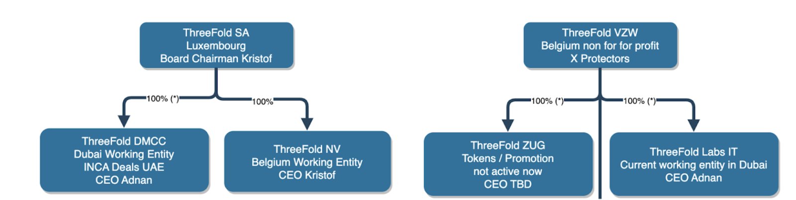

# FAQ

## Will we list TFT on big exchanges?

These days it's not really needed any longer to list on big exchanges, see an article Kristof wrote recently [https://medium.com/@despiegk/crypto-is-dead-long-live-crypto-c3d1d774630c](https://medium.com/@despiegk/crypto-is-dead-long-live-crypto-c3d1d774630c) 

Ecosystems like Algorand and Stellar are amazing and have everything required to let us grow our token organically.

## How will we support our TFT Price, if you don’t want to use exchanges and hype ?

We don’t believe hype or any of the other mechanisms used by most projects is feasible for us because it goes against our PPP concept and we don’t believe the timing is right anyhow.

See a doc we wrote about how we want to target our markets: [https://threefold.docsend.com/view/7fbsab8p54mids82](https://threefold.docsend.com/view/7fbsab8p54mids82) 

The TFT price can only go up because of how the tokenomics has been designed and how the community needs to show their support by staking for validators on our L2 as well as our Internet of Internets chains. Also technology partners will be asked to show their support by supporting liquidity pools or staking before we commit some of our time to help them achieve their own goals. 

At current TFT prices we would need many billions of TFT to be staked, which are simply not available, this will in the next months, support our price. Further out our healthy burning principle when people use the capacity of our grid will ensure that the amount of TFT in the market is limited leading to a healthy economic system.

At this first stage we are organizing a larger liquidity pool which will buy TFT upto a price of probably 0.5 USD per TFT, this pool can then be used to support liquidity as is needed for people who need TFT for staking or for buying compute, storage or network capacity on the ThreeFold grid.

We are built for the workloads of tomorrow, this will drive huge demand

* metaverse/gaming rendering/streaming engine (huge capacity is needed for this)
* Web 3.0 and 4.0 (4.0 is the big one in our opinion, this will host the digital life of hundreds of millions of people)
* IoT (support smart regenerative cities)
* more modern peer2peer defi systems (blockchains of the future)

## 

## Why is there not more marketing?

We have a very limited budget for marketing and are using it as optimally as we can, our focus is on community expanding activities which are working very well and we see a serious uptake in activity on website, forum, chat, ….

Another question could be, why didn't you decide to allocate more money to it then? That's of course a great question. We have been focussed on grid expansion as well as technology creation. We have created a lot of technology, actually TFTech has more technology compared to a couple of startups together, this was needed to make the bigger story succeed. This is now done, see the phases section above and you can see why this strategy.

See a doc we wrote about how we want to target our markets: [https://threefold.docsend.com/view/7fbsab8p54mids82](https://threefold.docsend.com/view/7fbsab8p54mids82)  \

We believe through real value, technology and people expanding the internet we will create most value for Planet & People which leads to value creation for our investors.

Probably more than 80% of our available budget has been used for technology & grid expansion, now is the time to change this, we have honestly done something amazing, this would not have been possible otherwise.

## Why ThreeFold Tech and ThreeFold Foundation?

ThreeFold SA is our TFTech company in Luxembourg with 2 working entities underneath, we report on all budgets consolidated, it's up to our financial team to make sure that intercompany transactions are done properly.

ThreeFold VZW is a not for profit organization with 2 working entities, the purpose is to hold the governance of the TFGrid, tokens and in the future use some of the treasury (income) to do further promotion of ThreeFold Grid.

## Why are we focused on TFGrid expansion rather than utilization

We have limited resources available and there is so much to do that we have to be very careful how we use our time. Expanding the grid especially in relation to the Neighborhood Clouds and OurWorld driven Internet of Internets approach is the first priority. 

Having enough capacity online is required to let our strategy succeed, it's almost like Elon musk needs thousands of satellites in the sky before it starts making sense, we have a similar challenge. If we want to become the biggest network of regenerative internet infrastructure capacity then we need to focus on expansion first.

Also the Neighborhood Clouds and OurWorld driven Internet is driving TFTech revenue right now which makes it possible to keep on expanding our team and deliver on the bigger vision.

By growing the grid we expand the staking model see our litepaper and above. By adding validators they have to stake lots of TFT, this means they have to buy them, buying from our liquidity pool is a good way.

Over summer our Uhuru (FreeFlow) which is already usable in Beta will be pushed out to more users, this will start driving more utilization. \

## Is the grid usable?

Of course it is, people are expanding & using the grid today. See [https://library.threefold.me/info/manual/#/manual3_home_new](https://library.threefold.me/info/manual/#//manual__manual3_home_new) how to get started. Today everything which can run on linux can run on the cloud.

Of course there are some known (non blocking) issues

* The UI is not user friendly enough (will be fixed in next release).
* The documentation needs improvement
* We don’t have people who can help the community, it's 100% community driven right now but it starts happening.
* We don’t have enough IP addresses
* We also need to be more clear about farming quality definition, it needs to be easier for people to define what a good farmer is.

Is the system good enough \

* We believe so, if not let us know why not and what we need to improve.

We keep on working on improvements to of course address above, but first priority is on tools to do with LIQUIDITY POOL and FARMING and our DAO, this is the first requirement now.

The TFGrid has been fully functional since the start of this year in version 3.0. We have chosen to keep the Grid in an Alpha/Beta state for now, Google did this for years. There is an operational devnet, testnet and mainnet.

While this is not our focus right now, we want to support some projects to launch our grid e.g. Owncloud. We are launching dedicated machines very soon, we expect this will appeal to quite some people and start using some more capacity.

## What are the priorities for the TFTech engineering organization

We need to keep on being focussed to make sure the TFGrid is stable and safe enough, thanks to more expanding testing and more people using it we keep on improving. We need a bigger team though, it's rather risky right now, we are doing all we can based on a lot of goodwill from our engineers & truck factor is high, but it's working.

PHASE 1

* We are implementing some required governance & community features (DAO, sales of 3nodes of blockchain, internet of internet story, TF staking, blockchain, better UI…) and doing maintenance engineering on TFGrid.
* We are focused on the Internet of Internets strategy and make sure it can work fully autonomously & decentralized. This will create a shortage for TFT and get the price to go up in an organic sound way.
* Peer2peer sales model for 3Nodes which allow anyone in our community to sell/buy 3nodes
* A better UI experience for our grid, more user friendly all in 1 place
* Bug fixes on our TFGrid
* Some additional weblets for deployment of solutions
    * OwnCloud (done)
    * Pocket.Network
    * Presearch
    * Uhuru (first P2P implementation of whatsapp/gdocs alternative)

PHASE 2

* Our DEFI P2P Wallet, allow everyone to sell/buy TFT in all easy & safety
* GPU support in 3Nodes.
* Farming on chain with required improvements to do with boosters for farming in relation to utilization.

## Is ThreeFold adequately funded, has the project the risk to stop?

We think we are fine, thanks to our wonderful group of investors and supporters we are able to get funding each month, the neighborhood Cloud concept also helps a lot. Thank you everyone for making it happen.

That being said, we don't have enough funding to go as fast as we would like, there are lots of people who would like to contribute on a full time basis to achieve the ThreeFold/OurWorld goals faster, this is not possible today. The planet needs it though. With the current team and community we are already doing the impossible, we need more fuel.

ThreeFold is burning close to 500k USD per month. This is a lot to carry and we need your help to keep on building our future. 

Thanks to our loyal investors and partners we were able to grow to where we are today. We are organizing a bigger fundraiser in TFTech and are looking for people who want to be part of this next round. We are doing a pre-round right now with a discount on the next round and organized as a convertible loan.

As you can read above there are lots of efforts around fundraising, please help if you can

* Liquidity Pool for TFT
* TFTech fundraise for capital increase

This should be enough to put us in a good spot soon.

## Will the farming rules still change

We expect they will have to change slightly of course we will do this with consensus of the community.

We will write some posts about it soon, but there needs to be a concept of boosters where people are rewarded for driving utilization as well and providing the best possible quality.

We also need some changes because of the Internet of Internets concept.

Some forum posts and GEP’s will follow soon. (GEP is Grid Enhancement Proposal)

## Is the TFGrid pricing good enough?

We believe we should be ok, see following forum post.

[https://forum.threefold.io/t/pricing-for-tfgrid/2518](https://forum.threefold.io/t/pricing-for-tfgrid/2518) 

## 

## What do you see as the biggest risks for TF?

Higher Risk

* Change in the economical environment might lead to e.g. not paying closed projects.
* Truck factor (see above, risk of losing important people for TF)
* Delivering on these huge projects like Zanzibar required the right team and more funding = execution risk.

Less Risk

* Cash wise we will be ok until at least the end of summer and there are quite some opportunities to work on, so we believe we should be able to find the required cash & funding. A lot of people want us to succeed. This should give a good base of like minded people.
* TFT token price, eventually this will go up thanks to our tokenomics model.