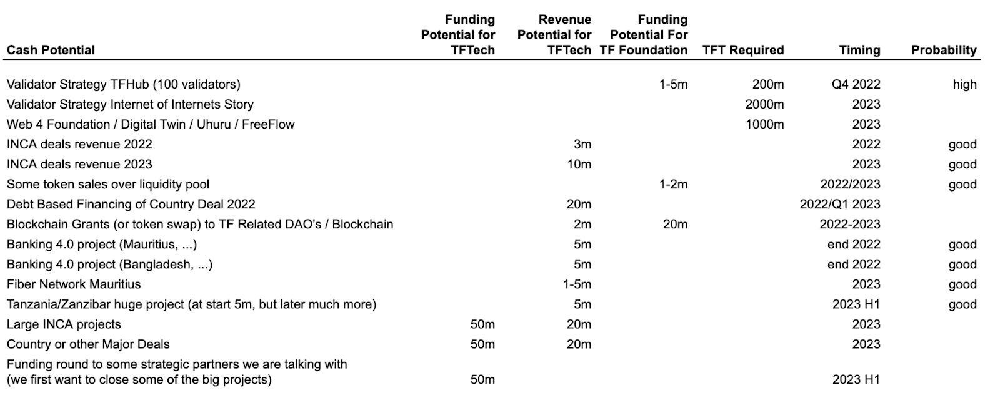

# TFTECH MISSION

TFTech is a for profit organization, while we underwrite the larger ThreeFold mission we have our own specific mission:  \
 \
**build the best technology as an infrastructure layer for an upgraded internet, make this technology available to as many parties as possible (through open source and the Internet of Internets approach). We purposely prioritize expansion over utilization during our early years.**

Organize a public Security Token Offering in 2023 and keep the option open for a Trade Sale of TFTech to a large player.  We believe that because of the following reasons we can capitalize on our work:

* Proven large projects show how traction is there and large parties want to use our technology  \
to enable their communities (by then we will have at least 2 of them signed).
* Our technology is proven and unique. No-other party today has a working system to create a true decentralized, green, scalable and safe internet backbone which can scale to billions of connected users and/or devices.
* A business model which can scale forever thanks to our tokenomics & distributed approach.
* TFTech owns a part of the Internet of Internets which leads to financial rewards as well (TFT). 
* A set of OurWorld experiences available for all participants in the local ThreeFold Internet.
* World Expanding Metaverse Engine in Their Community (rendering in local cloud)
* A regenerative DEFI system, allowing money to be generated in Community and allows some of the banking projects to materialize.

# The Simple Plan

FOCUS FOCUS FOCUS ON WHAT IS ALREADY WORKING…

We are a software company …

## 1. FUNDING ROUND AS PREPARATION ON STO in 2023

Within 1 year we expect to have achieved at least 2 of the following projects, this will give us a huge credibility boost and ability to fundraise for our STO at a good valuation.

* At least one big blockchain partner e.g. Algorand
* Tanzania Internet Country Project + Incubator with president (has also access to funding).
* Zanzibar Digital FreeZone + Internet Project
* Project with American Tribes (new large scale internet) US
* Project with a large 5G telco provider. US
* Mauritius Fiber Network (500k users)
* Country with +100m People, digital e-Bank (100m investment 5-10 for us)
* Triple Play e-Bank for Africa (exchange, custodial, digital-bank). Focus on remittance, Credit Unions, …  (2-5m USD)
* Multiple Neighborhood Clouds = INCA (1 closed, multiple on the way)
* +10.000 locations in the world for ThreeFold Grid.

We organize a pre-STO financing round see [http://funding777.threefold.me/](http://funding777.threefold.me/) 

This will give us enough cash to realize the above and also secure +50m TFT in our  treasury.

Even if for whatever reasons markets would not be in our favor or something else happens, thanks to our treasury of TFT and NeighborHood clouds we can just continue to be cash flow positive and grow organically.

## 2. MAKE THE TFT FLY

**The crypto world is reforming itself to become a stronger version of itself.** \
 \
We at ThreeFold are strong believers in the future of blockchain and digital democratization. Blockchain and Digital Ledger technology is here to stay, countries want this to stay as much as we do.

We are very confident that our TFT staking program as described above by means of the Internet of Internets concept will lead to serious shortage of TFT (see [http://liquidity.threefold.me](http://liquidity.threefold.me) ).

Acquiring as many TFT as we can in the liquidity pool has many advantages

* **Our tft price will go up, while many other projects might have a hard time maintaining their price.**
* The TFT perception problem will be resolved which will make it easier to get buy-in from larger communities and the press as well as influencers which are needed to make a project like ours known.
* We help people buy TFT, which today is a very difficult thing to do.  \
Try to buy 2m TFT for validators, it's +- not possible right now.
* It becomes less expensive for grid farming as the token price goes up, less tokens are farmed, making it more interesting for everyone involved. This is the same for INCA projects because farming is linked to the token price at time of registration.
* It's also a sort of cleanup, the people who don’t have the same vision as us will sell their TFT to our liquidity pool, which is perfectly ok, but they will lose 33% on possible value at start.

And of course there is a good reward for liquidity pool providers to do so (33% spread at start).

## 3. GO CASH FLOW POSITIVE

As TFTech we are on our way we might be cash flow positive &lt; 6 months because of following projects:

* INCA, neighborhood clouds (first 5m USD project closed, more projects underway)
* Sales of TFT (through liquidity pool and deployment of TF Validators), we use our treasury for this but we want to do this as little as possible, because the TFT value will grow tremendously over the next few years.

Next to our default income we are working on some big projects.  Below we describe in more detail to allow you to assess the relation between our effort spent and potential benefit for the planet, people and of course ourselves.  

See for more information about these projects in: [https://threefold.docsend.com/view/yfihsz9p9pc4wxxw](https://threefold.docsend.com/view/yfihsz9p9pc4wxxw) 

# What are our near term cash/revenue streams

## 

This is a super high level overview,it also shows how we have the potential to ramp up in nr of users.
